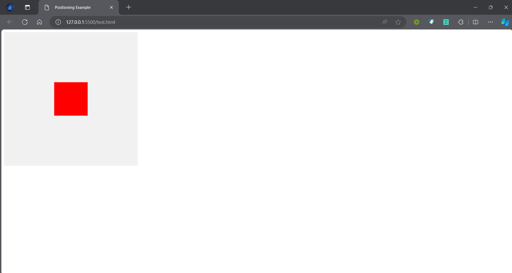
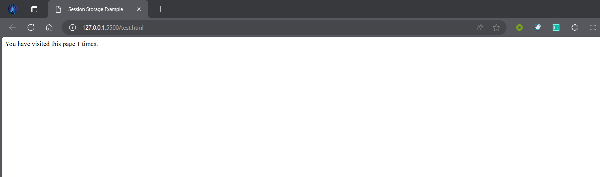
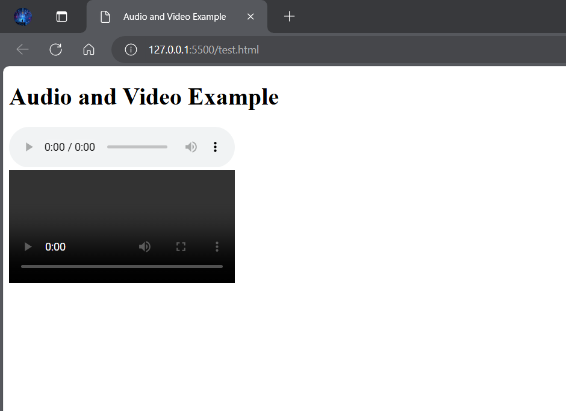

# SVG and Canvas

SVG (Scalable Vector Graphics) and Canvas are both commonly used technologies in web development for creating graphics and visual elements, but they have different approaches and use cases.

SVG is an XML-based vector image format for two-dimensional graphics with support for interactivity and animation. It allows for the creation of shapes, paths, text, and other graphical elements using markup tags similar to HTML. SVG images are resolution-independent, meaning they can be scaled to any size without losing quality, which makes them ideal for responsive web design. SVG graphics are also searchable, indexable, and can be styled using CSS.

Canvas, on the other hand, is a HTML5 element that provides a drawing surface for dynamic rendering of graphics using JavaScript. Unlike SVG, Canvas is raster-based, meaning it generates images pixel by pixel. Developers can use Canvas to draw shapes, lines, images, and text directly onto the web page programmatically. Canvas is well-suited for applications that require real-time rendering or complex animations, such as games, data visualization, and image editing tools.

The choice between SVG and Canvas depends on the specific requirements of the project. SVG is preferable for static or semi-static graphics that require scalability and accessibility, while Canvas is more suitable for dynamic and interactive visualizations that demand performance and flexibility.

# Geo Location API

The Geolocation API is a feature provided by modern web browsers that allows web applications to access the user's geographical location information. It enables developers to retrieve the latitude and longitude coordinates of the user's device, along with other optional data such as altitude, accuracy, and heading.

The Geolocation API is based on the W3C Geolocation Specification and is accessed using JavaScript. Developers can request the user's location using the `navigator.geolocation` object, which provides methods for obtaining the current position asynchronously. Once permission is granted by the user, the browser determines the device's location using GPS, Wi-Fi, or other location sources and returns the data to the application.

The Geolocation API has various use cases, including location-based services, mapping applications, weather forecasts, local search, and personalized content delivery. However, it's important for developers to handle user privacy and security considerations responsibly, as accessing sensitive location information requires explicit user consent and adherence to privacy regulations.

# CSS Navbar

A CSS navbar, or navigation bar, is a common UI component used in web design to provide navigation links for navigating a website. It typically appears at the top of the webpage and contains links to various sections or pages of the site.

Navbar styling is achieved using CSS (Cascading Style Sheets) to control the layout, appearance, and behavior of the navigation bar. This includes properties such as `background-color`, `font-family`, `padding`, `margin`, `border`, `text-decoration`, and `hover` effects to enhance interactivity.

Navbar designs can vary widely depending on the website's aesthetics and functionality. They may consist of simple text links, dropdown menus, icons, buttons, or a combination of these elements. Responsive design techniques are often employed to ensure the navbar adapts to different screen sizes and devices, such as smartphones and tablets.

Frameworks like Bootstrap provide pre-styled navbar components that developers can easily customize and integrate into their websites. These frameworks offer built-in classes and styles for creating responsive and visually appealing navigation bars with minimal CSS coding.

# Bootstrap Setup

Bootstrap is a popular front-end framework for building responsive and mobile-first websites and web applications. It provides a collection of pre-designed HTML, CSS, and JavaScript components, such as grids, forms, buttons, navigation bars, and more, that streamline the development process and ensure consistency across different browsers and devices.

Setting up Bootstrap involves including the necessary Bootstrap files in your project and configuring your HTML markup to utilize Bootstrap's classes and components effectively. Here are the basic steps to set up Bootstrap:

1. **Download Bootstrap:** You can download Bootstrap from the official website or use a content delivery network (CDN) to link to the Bootstrap files directly.

2. **Include Bootstrap files:** Add the Bootstrap CSS and JavaScript files to your HTML document using `<link>` and `<script>` tags. Optionally, you can also include Bootstrap's optional theme CSS file for additional styling options.

3. **Markup Structure:** Structure your HTML markup according to Bootstrap's conventions, utilizing its grid system and component classes to create responsive layouts and UI elements.

4. **Customization:** Customize Bootstrap's default styles and components by overriding the CSS classes or using custom CSS to tailor the appearance and behavior to your project's requirements.

5. **Testing and Optimization:** Test your website across different browsers and devices to ensure compatibility and responsiveness. Optimize your code and assets for performance by minifying CSS and JavaScript files and leveraging browser caching techniques.

Bootstrap offers extensive documentation and examples to help developers get started quickly and efficiently. By leveraging Bootstrap's robust framework, developers can accelerate the development process, maintain code consistency, and create visually appealing and user-friendly web experiences.

# Differences between HTML and HTML5

| Feature                | HTML                                      | HTML5                                    |
|------------------------|-------------------------------------------|------------------------------------------|
| **Doctype Declaration**| `<!DOCTYPE HTML>`                         | `<!DOCTYPE html>`                        |
| **New Elements**       | Limited set of elements like `<div>`, `<span>`, `<p>`, etc. | Introduces new semantic elements like `<header>`, `<nav>`, `<footer>`, `<article>`, `<section>`, `<video>`, `<audio>`, `<canvas>`, `<svg>`, etc. |
| **Audio/Video Support**| No native support for embedding audio or video. | Introduces `<audio>` and `<video>` elements for embedding media content with native browser support. |
| **Form Enhancements**  | Basic form controls and attributes.       | Adds new input types like `email`, `url`, `tel`, `number`, `date`, `color`, etc., along with attributes for validation, autofocus, placeholder, etc. |
| **Canvas and SVG**     | Not supported.                            | Introduces `<canvas>` element for drawing graphics dynamically and supports Scalable Vector Graphics (SVG) for resolution-independent vector images. |
| **Geolocation API**    | Not available.                            | Introduces Geolocation API for accessing the user's geographical location from the browser. |
| **Local Storage**      | Uses cookies for client-side storage.     | Introduces `localStorage` and `sessionStorage` APIs for storing data locally on the client side without expiration. |
| **Web Workers**        | No support for background scripts.       | Introduces Web Workers for running scripts in the background to improve performance and responsiveness. |
| **Cross-document Messaging** | Not available.                       | Introduces `postMessage()` API for secure communication between windows or iframes across different origins. |
| **Semantic Markup**    | Relies on `<div>` and `<span>` for structuring content. | Encourages the use of semantic elements like `<header>`, `<nav>`, `<footer>`, `<article>`, `<section>`, etc., for better accessibility and SEO. |
| **Browser Support**    | Supported by older and modern browsers.  | Requires modern browser support for full compatibility due to the introduction of new features and APIs. |

# CSS Position Properties

CSS position properties are used to control the position of an element within a container. They can be used to position elements relative to other elements or to control the layout of the page. The main CSS position properties are:

| Property | Description |
| -------- | ----------- |
| `static` | The element is not positioned in any special way; it is flush with other elements in the HTML flow. |
| `relative` | The element is positioned relative to its normal position. |
| `absolute` | The element is positioned relative to the browser window. |
| `fixed` | The element is positioned relative to the viewport, which means it always stays in the same place even if the page is scrolled. |
| `sticky` | The element is positioned relative to the nearest positioned ancestor. |

By using these position properties along with other CSS properties like `top`, `right`, `bottom`, and `left`, developers can create complex layouts and designs that respond to user interactions and viewport changes. Understanding how these position properties work is essential for building responsive and visually appealing web pages.

Example:

```html
<!DOCTYPE html>
<html>
<head>
    <title>Positioning Example</title>
    <style>
        .container {
            position: relative;
            width: 400px;
            height: 400px;
            background-color: #f1f1f1;
        }

        .element {
            position: absolute;
            top: 50%;
            left: 50%;
            transform: translate(-50%, -50%);
            width: 100px;
            height: 100px;
            background-color: red;
        }
    </style>
</head>
<body>
    <div class="container">
        <div class="element"></div>
    </div>
</body>
</html>
```



In the example above, the `.container` element is positioned relative to the browser window, while the `.element` is positioned absolutely within the container. The `top: 50%` and `left: 50%` properties center the `.element` within the `.container`, and the `transform: translate(-50%, -50%)` property adjusts the element's position to center it precisely.


# Web Storage

Web storage is a client-side storage mechanism that allows web applications to store data locally on the user's device. It provides a way to persist data across sessions and browser refreshes without relying on server-side storage solutions like cookies or databases.

The Web Storage is one of the great features of HTML5. With the Web Storage feature, web applications can locally store data within the browser on the client side. It stores data in the form of key/value pairs on the browser. Web Storage is sometimes also known as DOM storage.

Storing data with the help of web storage is similar to cookies, but it is better and faster than cookies storage. In comparison to cookies, Web Storage has the following advantages:

- Web Storage can use storage space up to 5MB per domain. (The browser software may prompt the user if the space limit is reached.)
- It will not send data to the server side, hence it is faster than cookies storage.
- The data stored by local storage never expires, but cookies data expires after some time or session.
- Web Storage is more secure than cookies.

The following are the key features of web storage:

| Feature | Description |
| ------- | ----------- |
| Local storage | Stores data in the browser's local storage. |
| Session storage | Stores data in the browser's session storage. |
| IndexedDB | Stores data in an indexed database. |
| WebSQL | Stores data in a web-based SQL database. |
| Cookies | Stores data in the browser's cookies. |

Web storage is widely used in web development for various purposes, such as caching data, storing user preferences, and implementing offline functionality. By leveraging web storage, developers can enhance the user experience, improve performance, and reduce server-side dependencies in their web applications.

There are two types of web storage: Local storage and session storage.

1. **Local Storage**: The data stored in local storage will not be deleted even after the browser is closed. The data will be stored until the user manually deletes it. The data stored in local storage will be available across all browser sessions. Meaning, the data will remain even after the user closes the browser.

Example:

```html
<!DOCTYPE html>
<html>
<head>
    <title>Local Storage Example</title>
    <script>
        if(localStorage.getItem('hits') === null) {
            localStorage.setItem('hits', 1);
        } else {
            let hits = parseInt(localStorage.getItem('hits'));
            hits++;
            localStorage.setItem('hits', hits);
        }
        document.write('You have visited this page ' + localStorage.getItem('hits') + ' times.');
    </script>
</head>
<body>
</body>
</html>
```


2. **Session Storage**: The data stored in session storage will be deleted once the browser is closed. The data stored in session storage will be available only for the current browser session. Meaning, the data will be deleted when the user closes the browser.

Example:

```html
<!DOCTYPE html>
<html>
<head>
    <title>Session Storage Example</title>
    <script>
        sessionStorage.setItem('page', 1);
        let page = sessionStorage.getItem('page');
        document.write('You have visited this page ' + page + ' times.');
    </script>
</head>
<body>
</body>
</html>
```




# Code for Audio & Video

HTML5 introduced native support for embedding audio and video content directly into web pages using the `<audio>` and `<video>` elements. These elements allow developers to include media files in various formats, such as MP3, OGG, WAV, and MP4, without the need for third-party plugins like Flash.

Here is an example of how to embed audio and video content using HTML5:

```html
<!DOCTYPE html>
<html>
<head>
    <title>Audio and Video Example</title>
</head>
<body>
    <h1>Audio and Video Example</h1>
    <audio controls>
        <source src="audio.mp3" type="audio/mpeg">
        Your browser does not support the audio element.
    </audio>
    <br>
    <video controls>
        <source src="video.mp4" type="video/mp4">
        Your browser does not support the video element.
    </video>
</body>
</html>
```

