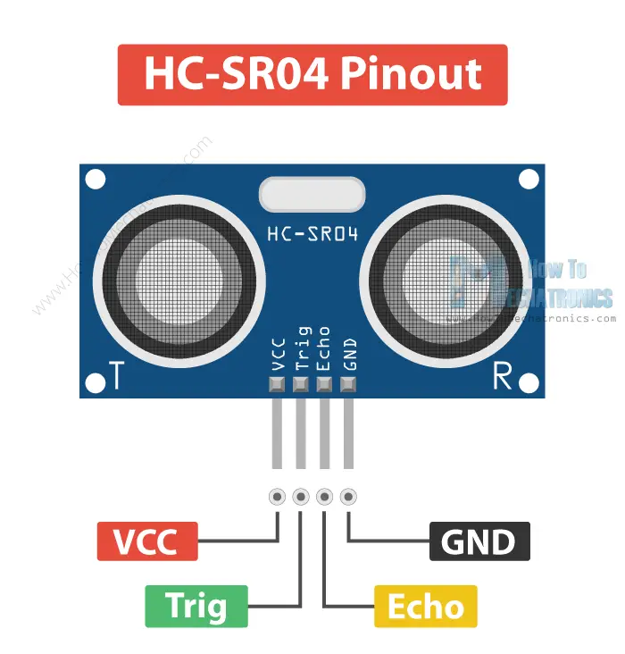
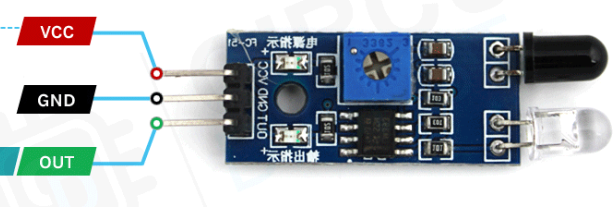
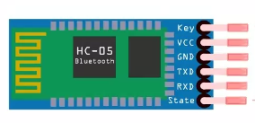
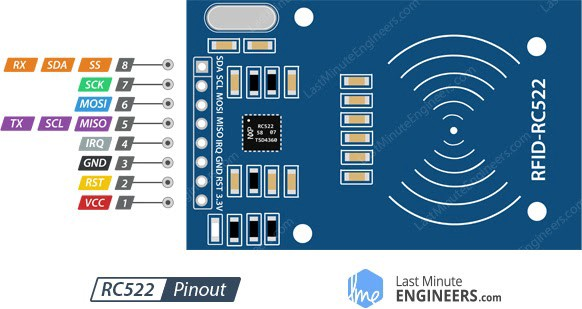
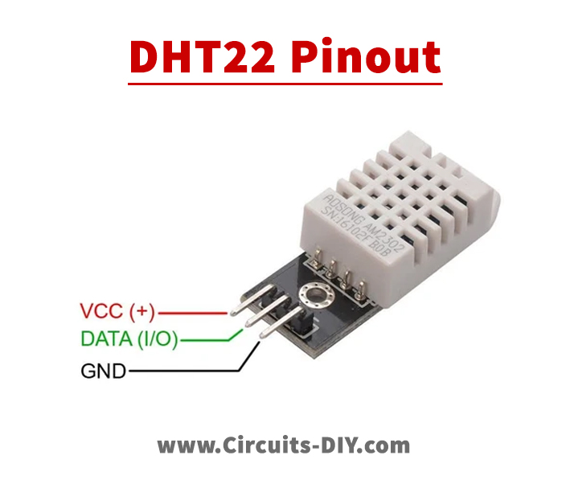

# Ultrasonic Sensor to find out the Distance



| Ultrasonic Sensor HC-SR04 | Arduino UNO R3 |
|:---|:---|
| Vcc | 5V |
| GND | GND |
| Echo | 5 |
| Trig | 6 |


```cpp
// Pin definitions for the ultrasonic sensor
#define ECHO_PIN 5
#define TRIG_PIN 6

// Variables for measuring distance
long duration; // Time needed for the ultrasonic pulse to travel and come back
int distance;  // Distance measured by the sensor

void setup() {
  // Set up the pins as output and input respectively
  pinMode(TRIG_PIN, OUTPUT);
  pinMode(ECHO_PIN, INPUT);

  Serial.begin(9600);
  Serial.print("Testing ultrasonic sensor HC-SR04 with Arduino UNO R3");
}

void loop() {
  // Clear the trigger pin to start the measurement
  digitalWrite(TRIG_PIN, LOW);
  delayMicroseconds(4);
  
  // Set the trigger pin to high for 10 microseconds to send a pulse
  digitalWrite(TRIG_PIN, HIGH);
  delayMicroseconds(10);
  digitalWrite(TRIG_PIN, LOW);
  
  // Measure the duration of the echo pulse
  duration = pulseIn(ECHO_PIN, HIGH);
  
  // Calculate the distance using the speed of sound
  distance = duration * (0.034/2);
  
  // Print the distance in cm
  Serial.print("Distance : ");
  Serial.print(distance);
  Serial.println(" cm");
}
```

# IR Sensor with LED ( Object detection )



| IR Sensor | Arduino UNO R3 |
|:---|:---|
| Vcc | 5V |
| GND | GND |
| OUT | 2 |

| LED | Arduino UNO R3 |
|:---|:---|
| +  | 13 |
| -  | GND |

```cpp
// Set up the IR sensor and LED pins
int sensorPin = 2; // IR sensor pin
int outputPin = 13; // LED pin

void setup() {
  // Set the sensor pin as input and the LED pin as output
  pinMode(sensorPin, INPUT);
  pinMode(outputPin, OUTPUT);
  
  // Start the serial communication for debugging
  Serial.begin(9600);
}

void loop() {
  // Read the sensor value
  int sensorValue = digitalRead(sensorPin);
  
  // Print the sensor value
  Serial.print("Sensor Value : ");
  Serial.print(sensorValue);
  
  // Wait for a second
  delay(1000);
  
  // If the sensor value is LOW, it means that an object is detected, so turn on the LED
  if (sensorValue == LOW) {
    digitalWrite(outputPin, HIGH);
  }
  // Otherwise, turn off the LED
  else {
    digitalWrite(outputPin, LOW);
  }
}
```

# Transfer sensor data to smartphone using Bluetooth on Arduino


| IR Sensor | Arduino UNO R3 |
|:---|:---|
| Vcc | 5V |
| GND | GND |
| OUT | 2 |



| Bluetooth | Arduino UNO R3 |
|:---|:---|
| RX | RX(0) |
| TX | TX(1) |
| GND | GND |
| VCC | Vin (5V) |


```cpp
// Set up the IR sensor pin as input and start the serial communication
const int irPin = 13; // IR sensor pin

void setup(){
  pinMode(irPin, INPUT);
  Serial.begin(9600);
} 

// Continuously read the IR sensor value and print it to the serial monitor
void loop(){
  // Read the sensor value
  int value = digitalRead(irPin);
  
  // Print the sensor value
  Serial.print(value);
  
  // Check if an obstacle is detected
  if (value == 0){
    Serial.print("Obstacle Detected!");
  }
  else{
    Serial.print("No Obstacle Detected!");
  }
  
  // Delay for a second before reading again
  delay(1000);
}
```

# Week 4(A)
## Implenting RFID using Arduino and MFRC522



| RFID(Radio Frequency Identification) | Arduino UNO R3 |
|:---|:---|
| SDA/SS | 10 |
| SDK | 13 |
| MOSI | 11 |
| MISO | 12 |
| IRQ | -- |
| GND | GND |
| RST | A5 |
| 3.3V | 3.3V |

```cpp
#include <SPI.h>  // SPI library is needed for communication with MFRC522
#include <MFRC522.h>

// Define pin connections
#define SS_PIN 10
#define RST_PIN A5

// Create MFRC522 object with specified pin connections
MFRC522 rfid(SS_PIN, RST_PIN);

// MIFARE_Key object to store key for authentication
MFRC522 :: MIFARE_Key key;

// Byte array to store the UID of the card
byte nuidPICC[4];

void setup(){
  // Initialize serial communication
  Serial.begin(9600);
  
  // Initialize SPI
  SPI.begin();
  
  // Initialize MFRC522
  rfid.PCD_Init();
  
  // Initialize MIFARE_Key with all bytes set to 0xFF
  for(byte i=0; i<6; i++){
    key.keyByte[i] = 0xFF;
  }
}

void loop(){
  // Check if a new card is present
  if(!rfid.PICC_IsNewCardPresent()){
    return;
  }
  
  // Read the UID of the card
  if(!rfid.PICC_ReadCardSerial()){
    return;
  }
  
  // Copy the UID of the card to nuidPICC array
  for(byte i=0; i<4; i++){
    nuidPICC[i] = rfid.uid.uidByte[i];
  }
  
  // Print the UID of the card in hexadecimal format
  printHex(rfid.uid.uidByte, rfid.uid.size);
  
  // Stop communication with the card
  rfid.PICC_HaltA();
  rfid.PCD_StopCrypto1();
}

// Print the hexadecimal value of a byte array
void printHex(byte *buffer, byte bufferSize){  
  for(byte i=0; i<bufferSize; i++){
    Serial.print(buffer[i] < 0x10 ? "0" : " ");
    Serial.print(buffer[i], HEX);
  }
}
```


# Week 5(A)



| DHT22 | Arduino UNO R3 |
|:---|:---|
| + | 5V |
| - | GND |
| DATA | 2 |

```cpp
#include "DHT.h"

// Define the type of sensor and the pin it is connected to
#define DHTTYPE DHT22
#define DHTPIN 2

// Create a DHT sensor object
DHT dht(DHTPIN, DHTTYPE);

void setup() {
  // Start the serial communication for debugging
  Serial.begin(9600);
  Serial.println(F("DHTxx Test!"));
  
  // Initialize the DHT sensor
  dht.begin();
}

void loop() {
  // Read the humidity and temperature from the sensor
  float h = dht.readHumidity();
  float t = dht.readTemperature();
  float f = dht.readTemperature(true); // Convert to Fahrenheit

  // Check if the reading was successful
  if (isnan(h) || isnan(t) || isnan(f)) {
    Serial.println("Failed to read the data from DHT sensor");
    return;
  }

  // Compute the heat index in Fahrenheit and Celsius
  float hif = dht.computeHeatIndex(f, h);
  float hic = dht.computeHeatIndex(t, h, false);

  // Print out the readings
  Serial.print("Humidity : ");
  Serial.print(h);
  Serial.print("% Temperature : ");
  Serial.print(t);
  Serial.print("°C ");
  Serial.print(f);
  Serial.print("°F Heat Index (F): ");
  Serial.print(hic);
  Serial.print("°C");
  Serial.print(hif);
  Serial.println("°F");

  // Wait for 2 seconds before reading again
  delay(2000);
}
```
