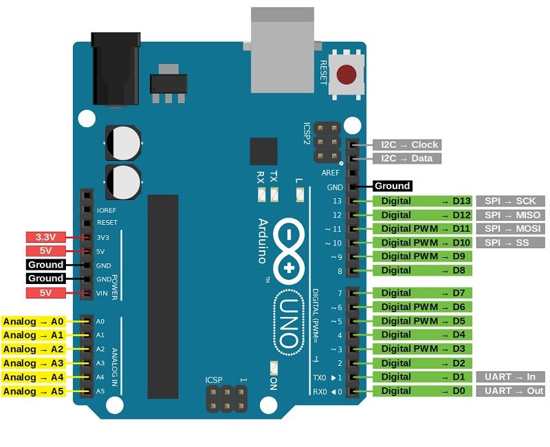
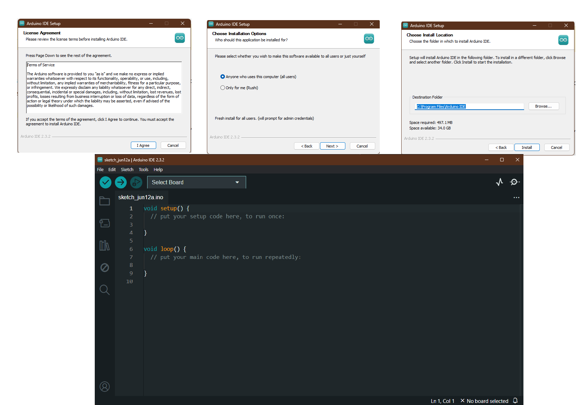
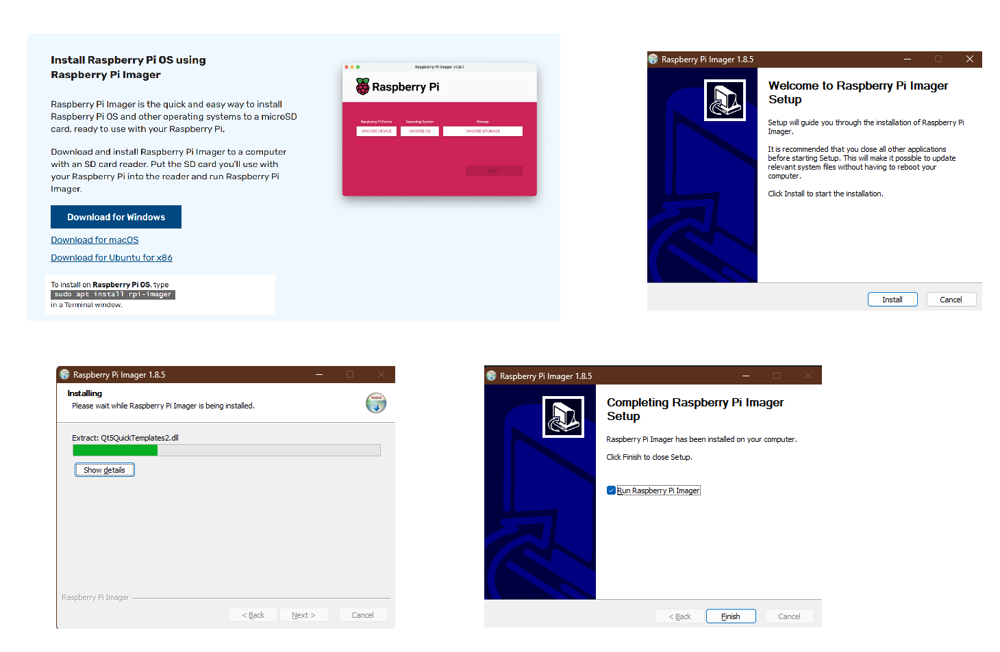
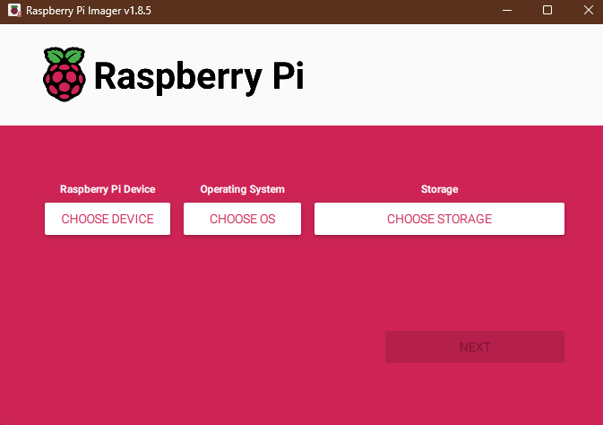
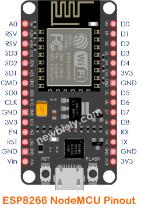
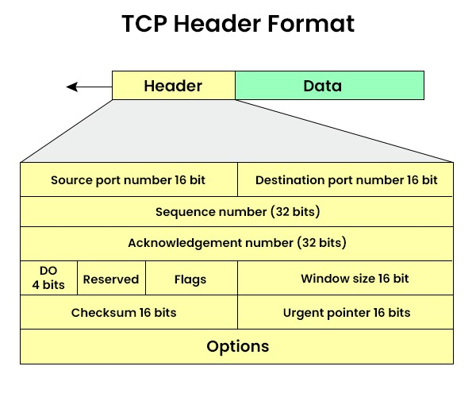
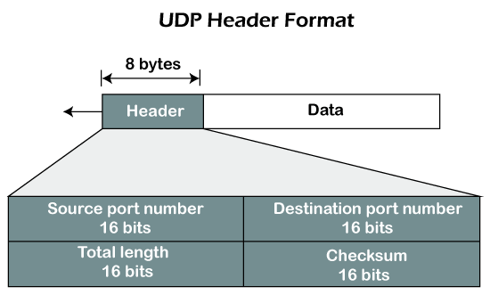

# Arduino Pin Diagram

- Arduino is an open-source electronics platform based on easy-to-use hardware and software. 
- It's widely used for building digital devices and interactive projects. Arduino boards can read inputs like light on a sensor or a finger on a button and turn them into outputs such as activating a motor or turning on an LED. 
- The Arduino programming environment is based on a simplified version of C++, making it accessible to beginners. 
- Popular in education, hobbyist, and professional fields, Arduino fosters creativity and innovation by enabling users to prototype and experiment with electronics without deep technical knowledge.

## Installation

- Go to Arduino website and download the Arduino IDE for your operating system.
- After downloading the IDE, install it by following the installation instructions.
- If you have downloaded the portable version of Arduino IDE, extract the files to your computer, copy to an appropriate location, and open the Arduino IDE.

# Raspberry Pi

- Raspberry Pi is a small, affordable, and versatile computer that can be used to learn programming through fun, practical projects.
- It is available in various types of operating systems, including Linux, Mac, and Windows.
- Raspberry Pi is used in education, hobbyist, and professional fields.
- It is also used for embedded systems development, IoT, and robotics.
- Raspberry Pi fosters creativity and innovation by enabling users to prototype and experiment with electronics without deep technical knowledge.

## Installation

- Go to Raspberry Pi website and download the Raspberry Pi OS for your operating system.
- After downloading the OS, install it by following the installation instructions.

# RFID Pin Diagram

- RFID(Radio Frequency Identification) is a technology that is used in security systems.
- It is used to identify devices that are near or in the vicinity of the RFID reader.
- An RFID reader is used to read the tags that are placed on the reader.
- Each tag has a unique ID that is used to identify the device that is near or in the vicinity of the reader.
- RFID is used in many fields, including education, hobbyist, and professional fields like IoT, robotics, and security.

# NodeMCU Pin Diagram (ESP8266)

- NodeMCU is a small, lightweight, and cost-effective IoT platform that provides a wide range of features and functionalities.
- It can connect to a variety of IoT devices such as sensors, actuators, and embedded systems.
- ESP8266 has inbuilt Wi-Fi module to connect to the internet.

# ThingSpeak

ThingSpeak is an open-source Internet of Things (IoT) platform that enables users to collect, store, analyze, visualize, and act on data from sensors or other devices over the internet. Developed by MathWorks, ThingSpeak provides a simple and efficient way to connect devices, particularly for real-time data logging and analysis. 

### Key Features:

- **Data Collection and Storage:** ThingSpeak allows users to gather data from multiple sources and store it in the cloud. This data can be collected through HTTP requests or directly from supported hardware like Arduino and Raspberry Pi.
  
- **Real-time Analysis:** The platform includes built-in MATLAB analytics, enabling users to process and analyze data in real-time. This makes it possible to implement complex algorithms for data processing without needing a separate server.

- **Visualization:** ThingSpeak offers powerful visualization tools, including dynamic charts and plots, which help users to monitor data trends and patterns visually. Customizable dashboards can display multiple data streams simultaneously.

- **Alerts and Actions:** Users can set up triggers and alerts based on specific data conditions. For instance, an alert can be sent if a sensor reading exceeds a predefined threshold, facilitating timely responses to critical events.

- **Community and Integration:** With a strong community support base, ThingSpeak integrates seamlessly with other IoT platforms and services, such as IFTTT, MATLAB, and social media, enhancing its functionality and reach.

ThingSpeak simplifies the process of managing IoT projects, making it an invaluable tool for researchers, engineers, hobbyists, and anyone interested in the IoT space.

# TCP vs. UDP

| **Aspect**          | **TCP**                                                                 | **UDP**                                                                                   |
|---------------------|--------------------------------------------------------------------------|------------------------------------------------------------------------------------------|
| **Connection**      | Establishes a connection before transmitting data.                       | Sends data without establishing a connection.                                            |
| **Reliability**     | Provides error-checking and guarantees data delivery in the correct order.| Does not ensure data delivery or order; packets may be lost or arrive out of order.      |
| **Flow Control**    | Manages data transmission rate to prevent congestion.                    | Lacks flow control mechanisms, which can lead to congestion and packet loss.             |
| **Overhead**        | Higher overhead due to connection setup, error-checking, and flow control.| Lower overhead as it avoids connection setup and minimal error-checking.                 |
| **Speed**           | Slower due to the additional processes ensuring reliability.             | Faster because it bypasses the processes that ensure reliability.                        |
| **Use Cases**       | Suitable for applications requiring reliable data transfer (e.g., HTTP, FTP, SMTP). | Ideal for real-time applications where speed is critical (e.g., live streaming, online gaming, VoIP). |

# TCP

- **Transmission Control Protocol (TCP)** is a connection-oriented protocol that provides reliable, ordered, and error-checked delivery of data between devices over a network.
- TCP is used in Internet protocols like HTTP, FTP, and SMTP.

TCP (Transmission Control Protocol) is a key internet protocol that ensures reliable data transfer between devices. It sets up a connection before sending data, making sure the information arrives correctly and in the right order. TCP also controls the data flow to avoid congestion. This reliability makes it perfect for activities like browsing the web, sending emails, and downloading files, where accurate data delivery is essential. While it can be slower and more complex than other protocols like UDP, TCP's dependability is crucial for many online services.

***DO** can be rewritten for **Header Length***

# UDP

- **User Datagram Protocol (UDP)** is a connectionless protocol that provides unreliable, unordered, and error-checked delivery of data between devices over a network.
- UDP is used in Internet protocols like DNS, DHCP, and TFTP.

UDP (User Datagram Protocol) is a connectionless protocol that sends data without establishing a connection. This makes it faster than TCP, but it doesn't guarantee data delivery or order. UDP is ideal for real-time applications like live streaming, online gaming, and VoIP, where speed is critical and some data loss is acceptable. While UDP lacks the reliability of TCP, it's a valuable tool for time-sensitive activities where speed is more important than accuracy.

