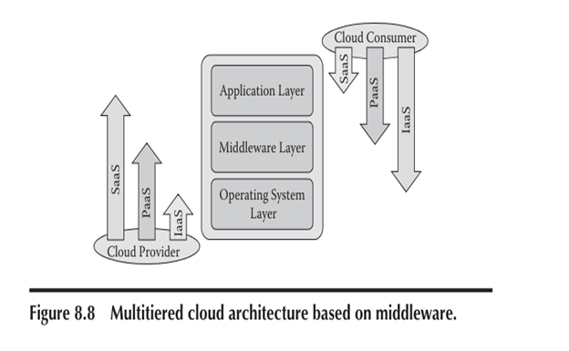
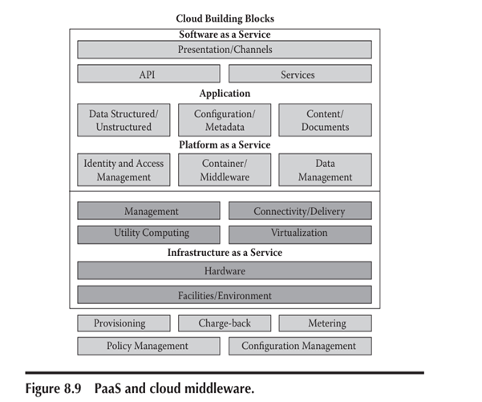
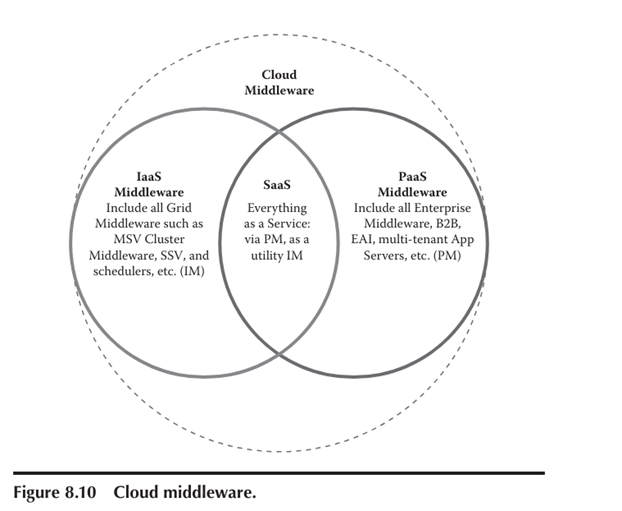

# Data Delivery Pricing in IoT

Data delivery pricing in IoT involves various models to manage the costs associated with transferring data between devices, networks, and platforms. This pricing strategy is essential for optimizing operational expenses and ensuring efficient resource usage. Here are some key aspects and models:

1. **Volume-Based Pricing**:
   - **Definition**: Charges are based on the amount of data transferred.
   - **Example**: Providers charge per gigabyte of data sent or received.
   - **Advantage**: Simple to understand and implement, cost scales with usage.

2. **Tiered Pricing**:
   - **Definition**: Different pricing tiers are set based on data usage thresholds.
   - **Example**: Lower rates for initial data usage, with higher rates as usage increases.
   - **Advantage**: Provides flexibility and can incentivize higher data usage within certain limits.

3. **Subscription-Based Pricing**:
   - **Definition**: Fixed monthly or yearly fee for a predefined amount of data.
   - **Example**: Plans offering 1TB of data per month for a fixed rate.
   - **Advantage**: Predictable costs, easy to budget for, and often includes additional services.

4. **Pay-As-You-Go Pricing**:
   - **Definition**: Users pay for the exact amount of data they use without any commitment.
   - **Example**: Charges per megabyte or gigabyte with no fixed contract.
   - **Advantage**: Ideal for users with variable or unpredictable data usage patterns.

5. **Value-Based Pricing**:
   - **Definition**: Pricing is based on the perceived value of the data rather than the volume.
   - **Example**: Higher charges for critical or high-value data, such as real-time analytics.
   - **Advantage**: Aligns costs with the business value derived from the data.

6. **Dynamic Pricing**:
   - **Definition**: Prices fluctuate based on network demand and availability.
   - **Example**: Lower costs during off-peak times and higher during peak usage periods.
   - **Advantage**: Can optimize network usage and reduce congestion.

7. **Hybrid Models**:
   - **Definition**: Combines elements of various pricing models.
   - **Example**: A base subscription fee with additional charges for overage.
   - **Advantage**: Offers a balance between predictable costs and flexibility.

Data delivery pricing models are designed to accommodate diverse user needs and optimize the cost-efficiency of IoT deployments. Each model has its own set of advantages and is chosen based on the specific requirements and usage patterns of the IoT application.

# Cloud Middleware Architecture

1. **Application Layer**:
   - **Function**: Acts as the interface between IoT devices and the network.
   - **Components**: User applications, API gateways.

2. **PaaS Middleware**:
   - **Function**: Supports SaaS applications, providing necessary platform services.
   - **Components**: Application servers, databases, developer tools.

3. **IaaS Middleware**:
   - **Function**: Manages core infrastructure services such as computing, storage, and networking.
   - **Components**: Virtual machines, storage systems, network services.

4. **Cluster Computing**:
   - **Function**: Aggregates multiple computers to work as a single entity for large-scale processing.
   - **Components**: Compute clusters, distributed file systems.

5. **Grid Computing**:
   - **Function**: Distributes processing tasks across multiple nodes to achieve parallel computing.
   - **Components**: High-performance computing (HPC) systems, parallel processing frameworks.

6. **Machine Virtualization**:
   - **Function**: Supports multiple virtual machines on a single physical machine, reducing overhead.
   - **Components**: Hypervisors, virtual machine managers.

This hierarchy shows how different layers of middleware support and interact with each other to enable a comprehensive cloud computing environment, particularly useful for IoT applications. The application layer interacts directly with IoT devices, while the underlying layers manage and optimize the infrastructure and platform services required for efficient operation.

# NIST’s SPI Architecture and Cloud Standards

The National Institute of Standards and Technology (NIST) has developed a comprehensive framework for cloud computing known as the SPI model, which stands for **Software as a Service (SaaS), Platform as a Service (PaaS), and Infrastructure as a Service (IaaS)**. This model provides a structured approach to understanding and implementing cloud services.

## SPI Model Architecture

1. **Software as a Service (SaaS)**:
   - **Description**: Provides access to applications over the internet without the need for underlying infrastructure or platform management by the user.
   - **Examples**: Email services (e.g., Gmail), office suites (e.g., Microsoft Office 365), and CRM systems (e.g., Salesforce).

2. **Platform as a Service (PaaS)**:
   - **Description**: Offers hardware and software tools over the internet, typically needed for application development. Users manage applications but not the underlying infrastructure.
   - **Examples**: Google App Engine, Microsoft Azure PaaS, and AWS Elastic Beanstalk.

3. **Infrastructure as a Service (IaaS)**:
   - **Description**: Provides virtualized computing resources over the internet. Users can manage operating systems, storage, deployed applications, and potentially limited control of select networking components.
   - **Examples**: Amazon Web Services (AWS EC2), Microsoft Azure IaaS, and Google Cloud Platform.

## Cloud Standards

NIST also outlines several cloud standards to ensure interoperability, security, and efficient cloud service deployment:

1. **Interoperability Standards**:
   - **Purpose**: Ensure that different cloud services can work together seamlessly.
   - **Key Standards**: Open Virtualization Format (OVF), Cloud Data Management Interface (CDMI), and Simple Object Access Protocol (SOAP).

2. **Security Standards**:
   - **Purpose**: Protect data and ensure privacy in the cloud.
   - **Key Standards**: Federal Information Security Management Act (FISMA), International Organization for Standardization (ISO/IEC 27001), and the Cloud Security Alliance (CSA) standards.

3. **Service Management Standards**:
   - **Purpose**: Provide guidelines for the management of cloud services.
   - **Key Standards**: Information Technology Infrastructure Library (ITIL), Distributed Management Task Force (DMTF) standards, and Open Cloud Computing Interface (OCCI).

4. **Performance Standards**:
   - **Purpose**: Ensure the reliable performance of cloud services.
   - **Key Standards**: Service Level Agreements (SLAs) guidelines, Quality of Service (QoS) standards, and Cloud Service Measurement Index Consortium (CSMIC) standards.

## Benefits of NIST's SPI Model and Standards

- **Standardization**: Promotes a unified approach to cloud services, enhancing compatibility and integration across different platforms and providers.
- **Security and Compliance**: Helps organizations adhere to best practices and regulatory requirements, ensuring data security and privacy.
- **Efficiency and Scalability**: Facilitates the efficient use of resources and scalability of services to meet varying demand.
