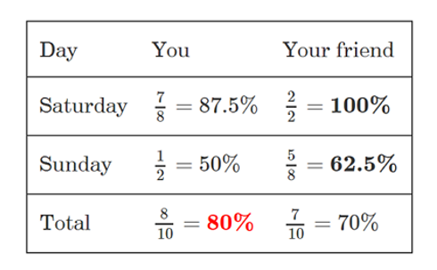
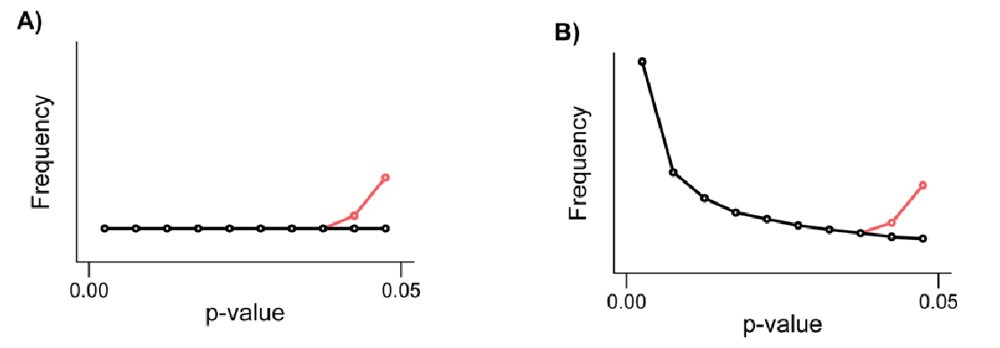

# Vectors in Machine Learning

In machine learning, vectors are fundamental data structures used to represent data points, features, weights, and other numerical information. A vector is essentially an ordered list of numbers, which can represent points in space, features of a data point, or coefficients in a model. Vectors are denoted using lowercase letters and can be represented in horizontal (row vector) or vertical (column vector) forms.

**Example:**
A vector $v$ with three elements can be written as:
$$v = (v_1, v_2, v_3)$$
or in column form:
$$v = \begin{pmatrix} v_1 \\ v_2 \\ v_3 \end{pmatrix}$$

## Operations on Vectors

1. **Vector Addition:**
   - Adding two vectors of the same length results in a new vector where each element is the sum of the corresponding elements of the input vectors.
   - **Example:**
     $$a = \begin{pmatrix} 1 \\ 2 \\ 3 \end{pmatrix}, \quad b = \begin{pmatrix} 4 \\ 5 \\ 6 \end{pmatrix}$$
     $$c = a + b = \begin{pmatrix} 1+4 \\ 2+5 \\ 3+6 \end{pmatrix} = \begin{pmatrix} 5 \\ 7 \\ 9 \end{pmatrix}$$

2. **Vector Subtraction:**
   - Subtracting one vector from another of the same length results in a new vector where each element is the difference of the corresponding elements.
   - **Example:**
     $$a = \begin{pmatrix} 1 \\ 2 \\ 3 \end{pmatrix}, \quad b = \begin{pmatrix} 4 \\ 5 \\ 6 \end{pmatrix}$$
     $$c = a - b = \begin{pmatrix} 1-4 \\ 2-5 \\ 3-6 \end{pmatrix} = \begin{pmatrix} -3 \\ -3 \\ -3 \end{pmatrix}$$

3. **Element-wise Multiplication:**
   - Multiplying two vectors element-wise results in a new vector where each element is the product of the corresponding elements.
   - **Example:**
     $$a = \begin{pmatrix} 1 \\ 2 \\ 3 \end{pmatrix}, \quad b = \begin{pmatrix} 4 \\ 5 \\ 6 \end{pmatrix}$$
     $$c = a \times b = \begin{pmatrix} 1 \times 4 \\ 2 \times 5 \\ 3 \times 6 \end{pmatrix} = \begin{pmatrix} 4 \\ 10 \\ 18 \end{pmatrix}$$

4. **Element-wise Division:**
   - Dividing one vector by another element-wise results in a new vector where each element is the quotient of the corresponding elements.
   - **Example:**
     $$a = \begin{pmatrix} 4 \\ 9 \\ 16 \end{pmatrix}, \quad b = \begin{pmatrix} 2 \\ 3 \\ 4 \end{pmatrix}$$
     $$c = a \div b = \begin{pmatrix} 4 \div 2 \\ 9 \div 3 \\ 16 \div 4 \end{pmatrix} = \begin{pmatrix} 2 \\ 3 \\ 4 \end{pmatrix}$$

5. **Dot Product:**
   - The dot product of two vectors is a scalar value obtained by multiplying corresponding elements and summing the results.
   - **Example:**
     $$a = \begin{pmatrix} 1 \\ 2 \\ 3 \end{pmatrix}, \quad b = \begin{pmatrix} 4 \\ 5 \\ 6 \end{pmatrix}$$
     $$a \cdot b = 1 \times 4 + 2 \times 5 + 3 \times 6 = 4 + 10 + 18 = 32$$

6. **Norm (Magnitude) of a Vector:**
   - The norm of a vector is a measure of its length. The Euclidean norm is the most common and is calculated as the square root of the sum of the squares of its elements.
   - **Example:**
     $$a = \begin{pmatrix} 1 \\ 2 \\ 3 \end{pmatrix}$$
     $$\|a\| = \sqrt{1^2 + 2^2 + 3^2} = \sqrt{1 + 4 + 9} = \sqrt{14}$$


# Central Limit Theorem (CLT)

The Central Limit Theorem is a fundamental concept in statistics and probability theory that states that the distribution of the sum (or average) of a large number of independent, identically distributed random variables approaches a normal (Gaussian) distribution, regardless of the original distribution of the variables. This theorem is crucial because it justifies the use of the normal distribution in many statistical procedures, even when the data do not follow a normal distribution.

**Key Points of the Central Limit Theorem:**
1. **Independence:** The random variables must be independent.
2. **Identically Distributed:** The random variables should be identically distributed.
3. **Sample Size:** The sample size should be sufficiently large (commonly n > 30 is used as a rule of thumb).
4. **Convergence to Normal Distribution:** As the sample size increases, the distribution of the sample mean approaches a normal distribution with mean $\mu$ (the population mean) and standard deviation $\sigma/\sqrt{n}$ (where $\sigma$ is the population standard deviation and $n$ is the sample size).

**Mathematical Expression:**
Let $X_1, X_2, \ldots, X_n$ be a sequence of $n$ independent and identically distributed (i.i.d.) random variables with mean $\mu$ and variance $\sigma^2$. The sample mean $\overline{X}$ is given by:
$$\overline{X} = \frac{1}{n} \sum_{i=1} {n} X_i$$

According to the CLT:
$$\frac{\overline{X} - \mu}{\sigma / \sqrt{n}} \rightarrow N(0, 1) \text{ as } n \rightarrow \infty$$
This means that the standardized sample mean follows a standard normal distribution (mean 0 and variance 1) as the sample size becomes large.

**Implications:**
- The CLT allows us to make inferences about the population mean using the sample mean.
- It underlies many statistical methods, including confidence intervals and hypothesis testing.

## Central Tendencies

Central tendencies are statistical measures that describe the center or typical value of a dataset. The most common measures of central tendency are the mean, median, and mode. These measures provide insight into the distribution of data points in a dataset.

1. **Mean (Arithmetic Average):**
   - The mean is the sum of all the data points divided by the number of data points.
   - **Formula:**
     $$\text{Mean} (\mu) = \frac{1}{n} \sum_{i=1}^n x_i$$
   - **Example:**
     For the dataset $3, 5, 7, 8, 10$:
     $$\text{Mean} = \frac{3+5+7+8+10}{5} = \frac{33}{5} = 6.6$$

2. **Median:**
   - The median is the middle value in a dataset when the values are arranged in ascending or descending order.
   - If the number of observations is odd, the median is the middle value.
   - If the number of observations is even, the median is the average of the two middle values.
   - **Example:**
     For the dataset $3, 5, 7, 8, 10$ (odd number of observations), the median is 7.
     For the dataset $3, 5, 7, 8$ (even number of observations), the median is $\frac{5+7}{2} = 6$.

3. **Mode:**
   - The mode is the value that occurs most frequently in a dataset.
   - A dataset may have no mode, one mode (unimodal), or more than one mode (bimodal or multimodal).
   - **Example:**
     For the dataset $3, 5, 7, 7, 8, 10$, the mode is 7 because it appears most frequently.

### Comparing Central Tendencies

- **Mean** is sensitive to extreme values (outliers), which can skew the mean, making it less representative of the dataset.
- **Median** is robust to outliers and provides a better measure of central tendency for skewed distributions.
- **Mode** is useful for categorical data where we want to know the most common category.

### Applications in Machine Learning

- **Data Preprocessing:** Understanding the central tendencies helps in normalizing or standardizing data.
- **Feature Engineering:** Central tendency measures can be used to impute missing values.
- **Model Interpretation:** Knowing the central tendency of features can provide insights into the distribution and nature of the data, aiding in better model interpretation and debugging.


# Statistical Hypothesis Testing

Statistical hypothesis testing is a method used to make decisions or inferences about population parameters based on sample data. It involves formulating a hypothesis, conducting experiments or collecting data, and then using statistical techniques to determine whether there is enough evidence to reject or fail to reject the hypothesis.

## Key Concepts

1. **Null Hypothesis (H0):**
   - The null hypothesis is a statement of no effect, no difference, or no change. It is the default assumption that any observed effect is due to random chance.
   - **Example:** H0: The mean test score of students who used a new study method is equal to the mean test score of students who used the traditional method.

2. **Alternative Hypothesis (H1 or Ha):**
   - The alternative hypothesis is a statement that indicates the presence of an effect, difference, or change. It is what the researcher aims to support.
   - **Example:** H1: The mean test score of students who used the new study method is higher than the mean test score of students who used the traditional method.

3. **Test Statistic:**
   - A test statistic is a standardized value calculated from sample data during a hypothesis test. It is used to determine whether to reject the null hypothesis.
   - Common test statistics include the Z-score, t-score, chi-square, and F-statistic.

4. **P-value:**
   - The p-value is the probability of obtaining a test statistic at least as extreme as the one observed, given that the null hypothesis is true.
   - A small p-value (typically ≤ 0.05) indicates strong evidence against the null hypothesis, so it is rejected.

5. **Significance Level (α):**
   - The significance level is a threshold set by the researcher (commonly 0.05) that determines whether the p-value is low enough to reject the null hypothesis.
   - **Example:** If α = 0.05 and p-value < 0.05, reject H0.

6. **Type I and Type II Errors:**
   - **Type I Error (α):** Incorrectly rejecting the null hypothesis when it is true (false positive).
   - **Type II Error (β):** Failing to reject the null hypothesis when it is false (false negative).

### Steps in Hypothesis Testing

1. **Formulate Hypotheses:**
   - Define the null hypothesis (H0) and alternative hypothesis (H1).

2. **Choose a Significance Level (α):**
   - Decide on the significance level, typically 0.05.

3. **Collect Data:**
   - Gather sample data relevant to the hypotheses.

4. **Calculate Test Statistic:**
   - Compute the test statistic (e.g., Z-score, t-score) based on the sample data.

5. **Determine P-value:**
   - Calculate the p-value corresponding to the test statistic.

6. **Make a Decision:**
   - Compare the p-value with the significance level α.
   - If p-value ≤ α, reject the null hypothesis.
   - If p-value > α, fail to reject the null hypothesis.

### Common Types of Hypothesis Tests

1. **Z-test:**
   - Used for large sample sizes (n > 30) or when the population variance is known.
   - Tests whether the sample mean is significantly different from the population mean.

2. **t-test:**
   - Used for small sample sizes (n ≤ 30) or when the population variance is unknown.
   - **Types of t-tests:**
     - **One-sample t-test:** Tests if the sample mean is significantly different from a known value.
     - **Independent two-sample t-test:** Tests if the means of two independent samples are significantly different.
     - **Paired t-test:** Tests if the means of two related groups are significantly different.

3. **Chi-square Test:**
   - Used for categorical data to assess how likely it is that an observed distribution is due to chance.
   - **Types of chi-square tests:**
     - **Chi-square goodness-of-fit test:** Tests if a sample distribution matches a population distribution.
     - **Chi-square test of independence:** Tests if there is an association between two categorical variables.

4. **ANOVA (Analysis of Variance):**
   - Used to compare the means of three or more groups.
   - Tests if at least one group mean is significantly different from the others.

### Example of Hypothesis Testing

**Scenario:**
A researcher wants to test if a new drug is more effective than the current drug. The effectiveness is measured by the reduction in blood pressure.

1. **Formulate Hypotheses:**
   - H0: The mean reduction in blood pressure for the new drug is equal to that of the current drug.
   - H1: The mean reduction in blood pressure for the new drug is greater than that of the current drug.

2. **Choose Significance Level:**
   - α = 0.05

3. **Collect Data:**
   - Sample data: Reduction in blood pressure for 30 patients using the new drug and 30 patients using the current drug.

4. **Calculate Test Statistic:**
   - Use an independent two-sample t-test to compare means.

5. **Determine P-value:**
   - Calculate the p-value based on the t-test statistic.

6. **Make a Decision:**
   - If the p-value is less than 0.05, reject the null hypothesis, indicating that the new drug is more effective.

### Conclusion

Statistical hypothesis testing is a powerful tool for making data-driven decisions and drawing inferences about population parameters. It provides a structured framework for evaluating the evidence against a null hypothesis, enabling researchers to make objective and reproducible conclusions based on sample data.


# Simpson's Paradox

Simpson's paradox is a statistical phenomenon where the direction of a relationship between variables can change when data is combined or disaggregated. This paradox occurs when groups of data show a certain trend, but when combined, the trend reverses. It is crucial to understand and identify this paradox to correctly interpret data. In simpler terms, it is when the relationship between two variables is not consistent. This paradox is named after Edward Simpson, who first described it in 1951.

## Definition of Simpson's paradox

**Consider n groups of data** such that group $i$ has $A_i$ trials and $0 \leq a_i \leq A_i$ "successes". Similarly, consider an analogous $n$ groups of data such that group $i$ has $B_i$ trials and $0 \leq b_i \leq B_i$ "successes". Then, **Simpson's paradox occurs** if:

$\frac{a_i}{A_i} < \frac{b_i}{B_i} \quad \text{for all } i=1,2,3,\ldots,n$

But, when we aggregate across all groups:

$\frac{\sum_{i=1}^{n} a_i}{\sum_{i=1}^{n} A_i} > \frac{\sum_{i=1}^{n} b_i}{\sum_{i=1}^{n} B_i}$

And **at least one of these inequalities is strict** (meaning that it is not in the equality case). Of course, we could also flip the inequalities and still have the paradox since $A$ and $B$ are chosen arbitrarily. This phenomenon where the relationship between two variables is not consistent is called Simpson's paradox.


## Examples of Simpson's paradox

In the example provided the paradox is demonstrated with a scenario where you and your friend each solve problems on Brilliant. Your friend answers a higher proportion correctly than you on each of two days. However, when the data from both days is combined, you actually solve a higher proportion correctly overall. This showcases how the relationship between individual days and the combined data can differ, leading to Simpson's paradox.



Let's revisit the problem accuracy competition example. Over the weekend:

1. **Saturday**:
   - You attempted 8 problems and solved 7 (accuracy: $\frac{7}{8}$).
   - Your friend attempted 2 problems and solved both (accuracy: $\frac{2}{2}$).
   - Your friend had better accuracy.
   
2. **Sunday**:
   - You attempted 2 problems and solved 1 (accuracy: $\frac{1}{2}$).
   - Your friend attempted 8 problems and solved 5 (accuracy: $\frac{5}{8}$).
   - Again, your friend had better accuracy.
   
3. **Overall**:
   - You solved 8 out of 10 problems.
   - Your friend solved 7 out of 10 problems.
   - Despite daily variations, your overall accuracy was higher.

In mathematical terms:
- Your accuracy: $\frac{8}{10}$
- Friend's accuracy: $\frac{7}{10}$

# Correlation and Causation

**Correlation** refers to the existence of a relationship or pattern between the values of two variables. It is often depicted visually through a scatterplot, where data points in the xy-plane can indicate the presence of a correlation. The correlation coefficient ranges from -1 to 1, providing a measure of the strength and direction of the relationship. However, correlation does not imply causation; it simply shows that two variables are related in some way. A correlation can be linear or non-linear, depending on the pattern observed in the scatterplot.

**Causation**, on the other hand, signifies that one event directly influences or causes another event to occur. In a causal relationship, there is an independent variable (the cause) and a dependent variable (the effect). Causation can only be established through appropriately designed experiments that demonstrate a cause-and-effect relationship. It is crucial to differentiate between correlation and causation, as correlation does not imply causation. Understanding the distinction between these concepts is vital in drawing accurate conclusions and making informed decisions based on data analysis.

## Correlation and Causation: A Visual Summary

**Correlation:**
Imagine you have two variables, X and Y, and you're interested in understanding if there's a relationship between them. You can plot them on a graph, with X on the horizontal axis and Y on the vertical axis. Each data point represents a pair of values for X and Y.

Here's an example scatterplot:

```
    Y
    |
    |    ●
    |           ●
    |    ●                ●
    |                 ●
    |          ●
    |                        ●
    |                ●
    |-------------------●-------- X
    |
    |
```

In this scatterplot, you see a general trend where as X increases, Y tends to increase as well. This positive relationship is an example of correlation.

Now, let's consider the correlation coefficient. It quantifies the strength and direction of the relationship between X and Y. If the correlation coefficient is close to 1, it indicates a strong positive correlation. If it's close to -1, it indicates a strong negative correlation. A correlation coefficient close to 0 suggests little to no correlation.

**Causation:**
Causation, on the other hand, implies that changes in one variable directly cause changes in another. It's not enough to observe a relationship; you need to establish a cause-and-effect relationship.

Here's an example:

Let's say you're investigating the relationship between studying hours and exam scores. You might observe a positive correlation – students who study more tend to get higher scores. However, this correlation doesn't necessarily mean that studying more causes higher scores. There could be other factors at play, such as natural aptitude or motivation.

To establish causation, you'd need to conduct experiments. For instance, you could divide students into two groups: one that studies a certain number of hours and another that studies less. Then, you could compare their exam scores to see if the group that studied more indeed achieved higher scores. This experimental design helps establish causation by controlling other variables that could influence the outcome.

**Visual Summary:**

- Correlation: Visualized through scatterplots, indicating the relationship between variables.
- Causation: Established through experiments, demonstrating a cause-and-effect relationship.


# Bayes' Theorem

Baye's theorem states that the probability of an event occurring given that another event has occurred is equal to the product of the probabilities of both events occurring. It is expressed mathematically as:

$P(A | B) = \frac{P(A \cap B)}{P(B)}$

i.e.,

$P(A | B) = \frac{P(A) \cdot P(B | A)}{P(B)}$

- An event $B$ can be explained by a set of exhaustive and mutually exclusive hypotheses $A_1, A_2, \ldots, A_n$.  - Given 'a priori' probabilities $P(A_1), P(A_2), \ldots, P(A_n)$ corresponding to a total absence of knowledge regarding the occurrence of $B$
- And conditional probabilities $P(B \vert A_1), P(B \vert A_2), \ldots, P(B \vert A_n)$, the 'a posteriori' probability $P(A_j \vert B)$ of some event $A_j$ is given by:

$P(A_j \vert B) = \frac{P(A_j) \cdot P(B \vert A_j)}{\sum_{i=1}^{n} P(A_i) \cdot P(B \vert A_i)}$

This formula calculates the probability of event $A_j$ given that event $B$ has occurred, based on the prior probabilities of each hypothesis $A_i$ and their corresponding conditional probabilities of $B$ given $A_i$.

Here's what each component represents:

- $P(A_j | B)$: This is the probability of hypothesis $A_j$ being true given that event $B$ has occurred. It's called the posterior probability.
  
- $P(A_j)$: This is the prior probability of hypothesis $A_j$ being true before observing any evidence.
  
- $P(B | A_j)$: This is the probability of observing event $B$ given that hypothesis $A_j$ is true. It's called the likelihood.
  
- $\sum_{i=1}^{n} P(A_i) \cdot P(B | A_i)$: This term represents the total probability of observing event $B$ over all possible hypotheses $A_1, A_2, \ldots, A_n$. It's calculated by summing the product of the prior probability of each hypothesis and the probability of observing event $B$ given that hypothesis.

**Interpretation:**

Bayes' theorem helps us figure out what's more likely, based on new information. We start with beliefs about different things, and then use the likelihood of new evidence to update them. The result is our new beliefs, which are more likely now.

**Example:**

Let's say we have a medical test for a disease, and we want to know the probability that a patient has the disease given that the test result is positive. Here:
- $A_j$ represents the hypothesis that the patient has the disease.
- $B$ represents the event of getting a positive test result.
- $P(A_j)$ is the prior probability of having the disease.
- $P(B | A_j)$ is the probability of getting a positive test result if the patient has the disease.
- $P(B)$ is the total probability of getting a positive test result.

We can use Bayes' theorem to calculate the posterior probability of having the disease given the positive test result, updating our prior belief based on the test outcome.

Overall, Bayes' theorem is a powerful tool for updating beliefs in the face of uncertainty and is widely used in various fields such as medicine, engineering, and machine learning.


# P-Hacking and Strategies to Avoid It

P-Hacking involves the **misuse of data analysis** techniques to find patterns that appear statistically significant but are not truly meaningful. This practice can lead to false positives and incorrect conclusions in statistical analysis.  

In simpler terms, p-hacking is when someone plays around with data analysis to find results that seem important, even if they're not really meaningful. It's like trying different ways of looking at data until something seems to stand out, even if it's just by chance. This can make it seem like there's a significant finding when there isn't, leading to incorrect conclusions in statistical analysis. So, it's important to be careful and not manipulate data to fit a desired outcome.

- The **p-value**, short for probability value, tells us the likelihood, according to the model in the null hypothesis, of getting a test statistic as extreme as, or even more extreme than, what we observed in the data.

- A small p-value suggests that the tail beyond the observed statistic is small. In other words, the observed statistic is quite different from what the null hypothesis predicts. This indicates that the data provide stronger support for the alternative hypothesis rather than for the null.

- Typically, when the p-value is below 0.05, we consider the result statistically significant. In such cases, we reject the null hypothesis because the data provide strong evidence against it.

## Examples of P-Hacking

Consider we have 5 types of CoronaVirus candidate Vaccines with us for which we need to check which one has actual impact on recovery time of patients. So let’s say we do Hypothesis Tests for all 5 types of vaccines one by one. We set the alpha as 0.05. And hence if P-Value for any vaccine comes less than that, we say we can reject the Null Hypothesis.. Or can we?



Say, Vaccine A gives a P-Value of 0.2, Vaccine B gives 0.058, Vaccine C gives 0.4, Vaccine D gives 0.02, Vaccine E gives 0.07.
Now, by above results, a naive way to deduce will be that Vaccine D is the one which significantly reduces recovery time and can be used as the CoronaVirus Vaccine. But can we really say that just yet No. If we do, we might be P-Hacking. As this can be a **false positive**.

One way to avoid P-Hacking is to use **Multiple Hypothesis Testing**. This is when we do multiple Hypothesis Tests and then find the best one. The best one will be the one which has a P-Value less than 0.05.

- One way to tackle this would be to increase the number of tests. So more the tests, more easily you can say that the maximum number of tests are resulting in rejection of Null. 

- But also, more tests will mean that there will be more false positives(5% of total tests in our case). 5 out of 100, 50 out of 1000 or 500 out of 10,000! This is also called the Multiple Testing Problem.

- P-Hacking or Data dredging is a method to misuse the data analysis techniques to find patterns in data that appear significant but are not. This method affects the study negatively as it gives false promises to provide significant data patterns which in turn can lead to a drastic increase in the number of false positives.
