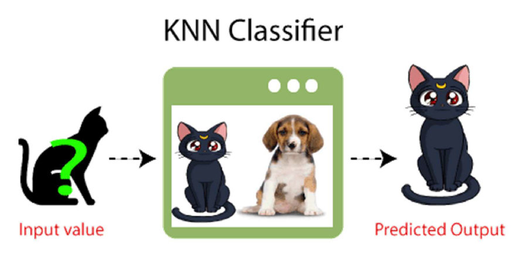
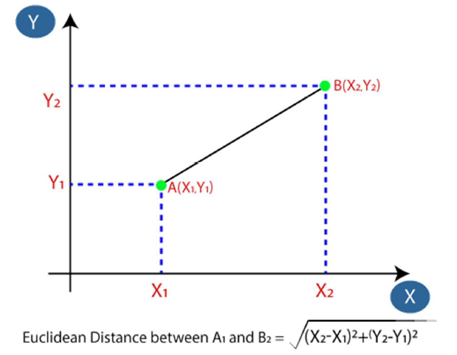
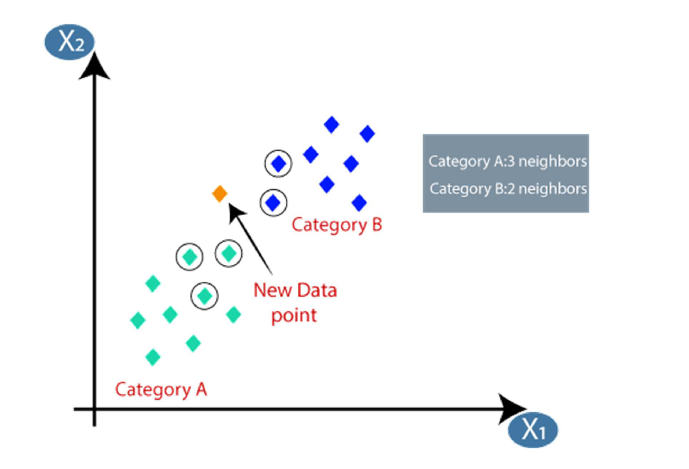
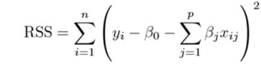
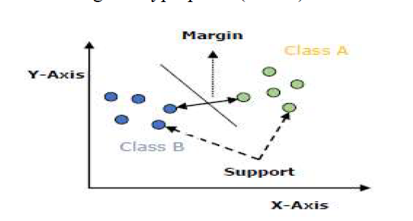

# Train-Test Split Evaluation

The train-test split is a crucial technique for assessing the performance of a machine learning algorithm, applicable to both classification and regression tasks across various supervised learning algorithms. The process involves dividing a dataset into two distinct subsets: the training dataset and the test dataset.

The training dataset is utilized to train the machine learning model, allowing it to learn patterns and relationships within the data. Conversely, the test dataset remains untouched during the training phase. Instead, it serves as an unseen dataset to evaluate the trained model's performance. Here, the model takes input data from the test dataset, generates predictions, and compares them to the actual values, enabling an assessment of how well the model generalizes to new, unseen data.

The primary objective of this approach is to estimate the model's performance on new data that wasn't used during training. Essentially, it simulates real-world scenarios where the model needs to make predictions on unseen data. This ensures that the model's performance is not biased by the data it was trained on.

However, it's crucial to note that the train-test split procedure is most effective when dealing with sufficiently large datasets. This is because smaller datasets may not provide enough data for the model to learn effectively during training or to evaluate its performance accurately during testing.

To implement the train-test split in practice, various libraries such as `train_test_split` from `sklearn` can be used. These libraries facilitate the seamless partitioning of the dataset into training and testing subsets, ensuring that both sets contain a representative sample of data to train and evaluate the model effectively. Without an appropriate train-test split, the model may suffer from overfitting due to lack of data for training or underfitting due to inadequate evaluation on unseen data.

# Naïve Bayes Algorithm

### Overview
The Naïve Bayes algorithm is a probabilistic classifier based on Bayes' Theorem, which assumes independence among predictors. Despite this assumption, the algorithm performs well in many real-world situations, especially in text classification and spam filtering.

### Bayes' Theorem
Bayes' Theorem provides a way to calculate the probability of a hypothesis given prior knowledge. It is formulated as:

$$P(A|B) = \frac{P(B|A) \cdot P(A)}{P(B)}$$

where:
- $P(A|B)$ is the probability of event A occurring given that B is true.
- $P(B|A)$ is the probability of event B occurring given that A is true.
- $P(A)$ is the probability of event A.
- $P(B)$ is the probability of event B.

### Naïve Bayes Classifier
The Naïve Bayes classifier applies Bayes' Theorem with the "naive" assumption of conditional independence between every pair of features given the class label. For a given data point described by features $X = (x_1, x_2, ..., x_n)$, the probability of it belonging to class $C$ is:

$$P(C|X) \propto P(C) \cdot P(x_1|C) \cdot P(x_2|C) \cdot ... \cdot P(x_n|C)$$

This simplifies the calculation and makes the algorithm scalable.

#### Steps in Naïve Bayes Classification
1. **Calculate Prior Probability**: Compute the prior probability for each class based on the training data.
2. **Likelihood Calculation**: For each feature, compute the likelihood of that feature given each class.
3. **Posterior Probability**: Use Bayes' Theorem to calculate the posterior probability for each class.
4. **Class Prediction**: Assign the class with the highest posterior probability to the data point.

#### Example
Consider a dataset for classifying whether it is suitable to play golf based on weather conditions (outlook, temperature, humidity, windy). Using Naïve Bayes, the classification would involve:

- Calculating the prior probability of playing golf and not playing golf.
- Calculating the likelihood of each feature (e.g., sunny, cool, high humidity, no wind) given the two classes.
- Applying Bayes' Theorem to find the posterior probability for playing and not playing golf.
- Predicting the class with the highest posterior probability.

# K-Nearest Neighbors (K-NN) Algorithm

#### Overview
K-NN is a simple, non-parametric, and lazy learning algorithm used for classification and regression. It works by finding the K closest data points (neighbors) in the training set and making predictions based on these neighbors.

#### Steps in K-NN
1. **Choose the Number of Neighbors (K)**: Select an appropriate value for K.
2. **Calculate Distance**: Compute the distance between the test data point and all training data points using a distance metric like Euclidean distance.
3. **Identify Neighbors**: Select the K data points that are closest to the test data point.
4. **Classify**: Determine the class of the test data point based on the majority class of the K nearest neighbors.

#### Example
Suppose we want to classify a new data point that looks similar to a cat or a dog. Our dataset contains images labeled as either cat or dog.

1. **Choose K**: Assume K=3.

2. **Calculate Distance**: Compute the Euclidean distance between the new image and all images in the training set.

3. **Identify Neighbors**: Suppose the 3 nearest neighbors consist of 2 images labeled as cat and 1 image labeled as dog.
4. **Classify**: The new image is classified as a cat because the majority of the 3 nearest neighbors are cats.

#### Advantages and Disadvantages of K-NN
- **Advantages**:
  - Simple and easy to implement.
  - No training period, making it a fast algorithm.
  - Can handle multi-class cases.

- **Disadvantages**:
  - Requires selection of K, which can be complex.
  - Computationally expensive, especially with large datasets.
  - Sensitive to the scale of the data and irrelevant features.

# Regularization

Regularization is a technique used in regression to prevent overfitting by constraining or shrinking the coefficient estimates towards zero. It discourages learning overly complex models by adding a penalty to the loss function used for training the model. The primary goal is to improve the model's generalization to new data by reducing its sensitivity to noise in the training data.

### RSS Equation
The Residual Sum of Squares (RSS) is the loss function used in linear regression and is defined as:
$$RSS = \sum_{i=1}^n (y_i - \hat{y}_i)^2$$
where $y_i$ is the actual value, and $\hat{y}_i$ is the predicted value.

### Ridge Regression (L2 Regularization)
Ridge regression modifies the RSS by adding a penalty term proportional to the sum of the squared coefficients:
$$\text{Ridge Penalty} = \lambda \sum_{j=1}^p \beta_j^2$$
The new loss function to be minimized becomes:
$$RSS + \lambda \sum_{j=1}^p \beta_j^2$$
Here, $\lambda$ is the tuning parameter that controls the strength of the penalty. As $\lambda$ increases, the coefficients are shrunk towards zero, reducing the model's complexity.

### Lasso Regression (L1 Regularization)
Lasso regression also modifies the RSS by adding a penalty term, but it uses the sum of the absolute values of the coefficients:
$$\text{Lasso Penalty} = \lambda \sum_{j=1}^p |\beta_j|$$
The new loss function becomes:
$$RSS + \lambda \sum_{j=1}^p |\beta_j|$$
Lasso not only shrinks coefficients but can set some of them to zero, effectively performing feature selection.

### Elastic Net Regression
Elastic Net combines both L1 and L2 penalties:
$$\text{Elastic Net Penalty} = \alpha \sum_{j=1}^p |\beta_j| + (1 - \alpha) \sum_{j=1}^p \beta_j^2$$
The loss function is:
$$RSS + \alpha \sum_{j=1}^p |\beta_j| + (1 - \alpha) \sum_{j=1}^p \beta_j^2$$
Here, $\alpha$ is a hyperparameter that balances the contributions of L1 and L2 penalties. This method retains the benefits of both ridge and lasso regression, making it useful when dealing with highly correlated predictors.

### Standardization of Predictors
For ridge and elastic net regression, it is essential to standardize predictors (i.e., bring them to the same scale) since these methods are not scale-invariant. This ensures that all predictors contribute equally to the regularization process.

In summary, regularization techniques like ridge, lasso, and elastic net help in building models that generalize better to new data by penalizing large coefficients and thus controlling model complexity.

# Random Forest Algorithm

The Random Forest algorithm is a popular machine learning technique used for both classification and regression tasks. It is based on the concept of ensemble learning, which involves combining multiple classifiers to solve complex problems and improve the performance of the model. In simple words, Random Forest builds multiple decision trees on different subsets of the data and then combines their predictions to make a final prediction.

### Key Characteristics

- **Ensemble of Decision Trees**: Random Forest consists of multiple decision trees built on different subsets of the dataset. The final output is determined by aggregating the predictions from each tree, often using majority voting for classification or averaging for regression.
- **Random Subsets**: Each decision tree is trained on a random subset of the data points, which helps in reducing variance and avoiding overfitting.
- **Feature Randomness**: In addition to using random subsets of data points, Random Forest also introduces randomness in the selection of features to split on while creating trees. This further decorrelates the trees and improves the model's performance.

### Working Process

1. **Data Sampling**: Select random K data points from the training set.
2. **Tree Building**: Construct decision trees for these data points.
3. **Model Creation**: Choose the number $N$ of trees to build and repeat the sampling and tree-building steps.
4. **Prediction**: For a new data point, obtain the prediction from each decision tree. The final prediction is based on the majority vote (classification) or average (regression).

### Advantages

- **Versatility**: Capable of performing both classification and regression tasks.
- **Robustness**: Handles large datasets with higher dimensionality effectively.
- **Accuracy**: Reduces the risk of overfitting by averaging multiple trees.

### Disadvantages

- **Complexity**: More computationally intensive and complex compared to a single decision tree.
- **Interpretability**: Less interpretable than individual decision trees.

# Support Vector Machines (SVM)

Support Vector Machines (SVM) are supervised learning models used for classification and regression tasks. They are particularly well-known for their application in classification problems.

### Key Concepts

- **Hyperplane**: SVM aims to find the best hyperplane that separates data points of different classes. The best hyperplane is the one that maximizes the margin between the data points of different classes.
- **Support Vectors**: The data points that are closest to the hyperplane are called support vectors. These points are critical in defining the position and orientation of the hyperplane.
- **Margin**: It may be defined as the gap between two lines on the closet data points of different classes. It can be calculated as the perpendicular  istance from the line to the support vectors. Large margin is considered as a good margin and small margin is considered as a bad margin.

### Working Process

1. **Training**: The SVM algorithm takes labeled training data and finds the optimal hyperplane that separates the classes.
2. **Margin Maximization**: It maximizes the distance (margin) between the closest data points (support vectors) of the classes.
3. **Kernel Application**: If the data is not linearly separable, it uses kernel functions to map the input features into higher-dimensional spaces.
4. **Prediction**: For new data points, SVM predicts the class based on which side of the hyperplane they fall on.

### Advantages

- **Effective in High Dimensions**: Works well with high-dimensional data.
- **Memory Efficient**: Only uses a subset of training data (support vectors) for making decisions.
- **Flexibility**: The use of different kernel functions allows SVM to adapt to various data complexities.

### Disadvantages

- **Computational Complexity**: Training can be computationally intensive, especially with large datasets.
- **Choice of Kernel**: The performance highly depends on the choice of the kernel and its parameters.
