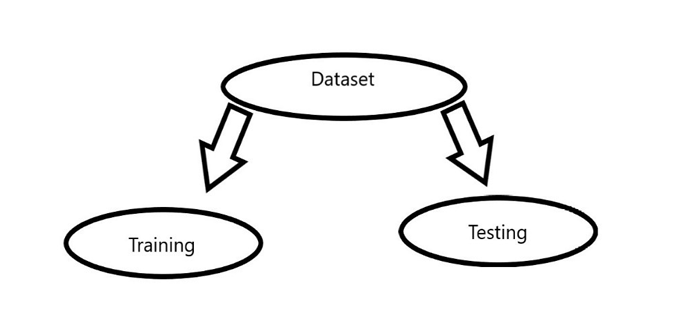
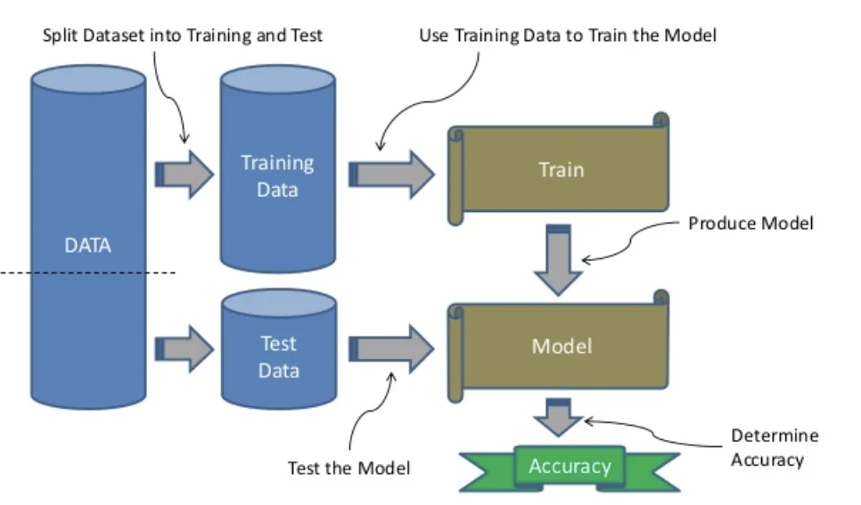

# Train-Test Split Evaluation

The train-test split is a crucial technique for assessing the performance of a machine learning algorithm, applicable to both classification and regression tasks across various supervised learning algorithms. The process involves dividing a dataset into two distinct subsets: the training dataset and the test dataset.

The training dataset is utilized to train the machine learning model, allowing it to learn patterns and relationships within the data. Conversely, the test dataset remains untouched during the training phase. Instead, it serves as an unseen dataset to evaluate the trained model's performance. Here, the model takes input data from the test dataset, generates predictions, and compares them to the actual values, enabling an assessment of how well the model generalizes to new, unseen data.

The primary objective of this approach is to estimate the model's performance on new data that wasn't used during training. Essentially, it simulates real-world scenarios where the model needs to make predictions on unseen data. This ensures that the model's performance is not biased by the data it was trained on.

However, it's crucial to note that the train-test split procedure is most effective when dealing with sufficiently large datasets. This is because smaller datasets may not provide enough data for the model to learn effectively during training or to evaluate its performance accurately during testing.

To implement the train-test split in practice, various libraries such as `train_test_split` from `sklearn` can be used. These libraries facilitate the seamless partitioning of the dataset into training and testing subsets, ensuring that both sets contain a representative sample of data to train and evaluate the model effectively. Without an appropriate train-test split, the model may suffer from overfitting due to lack of data for training or underfitting due to inadequate evaluation on unseen data.