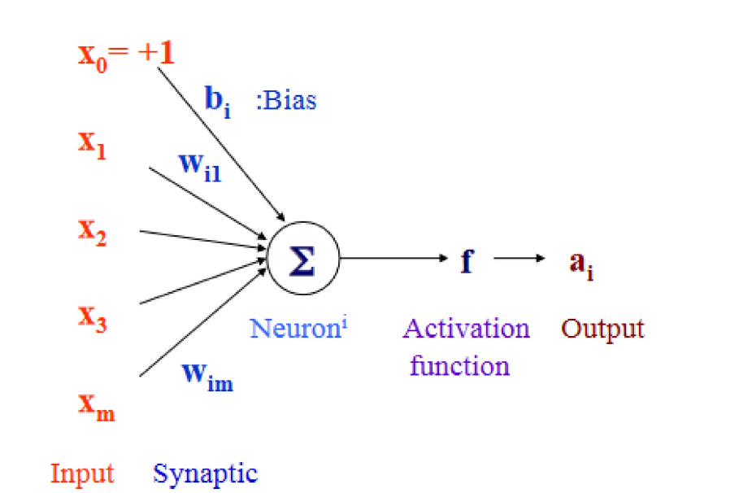
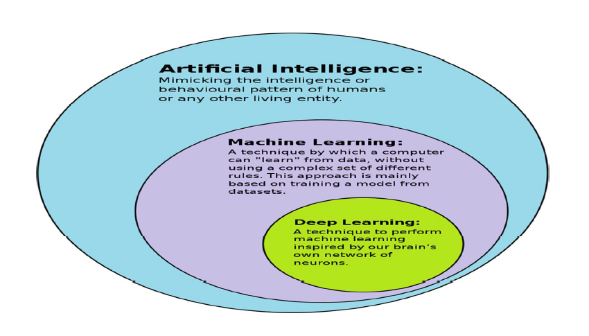
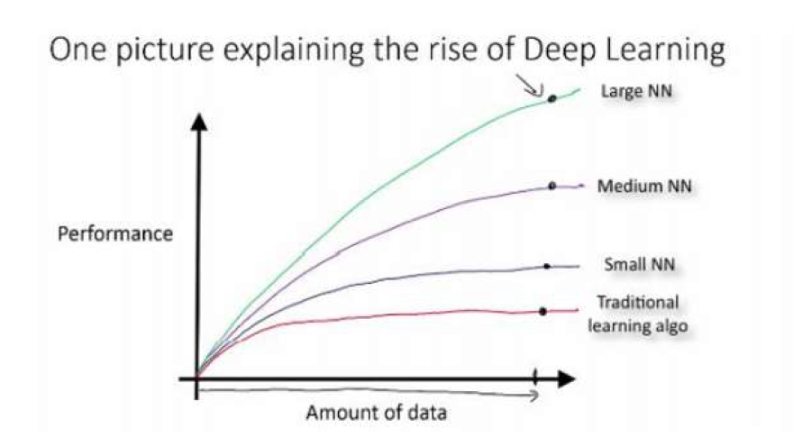
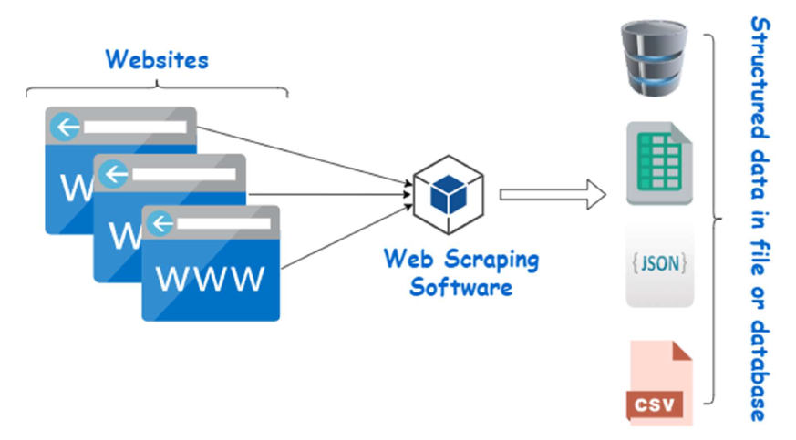
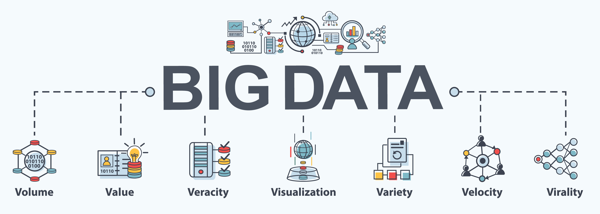

# Find-S Algorithm

The find-S algorithm is a basic concept learning algorithm in machine learning. The find-S algorithm finds the most specific hypothesis that fits all the positive examples. We have to note here that the algorithm considers only those positive training examples. The find-S algorithm starts with the most specific hypothesis and generalizes this hypothesis each time it fails to classify an observed positive training data. Hence, the Find-S algorithm moves from the most specific hypothesis to the most general hypothesis.

## Important Representation:

1. `?` indicates that any value is acceptable for the attribute.
2. specify a single required value (e.g., Cold) for the attribute.
3. $ϕ$ indicates that no value is acceptable.
4. The most general hypothesis is represented by: {?, ?, ?, ?, ?, ?}
5. The most specific hypothesis is represented by: $\{ϕ, ϕ, ϕ, ϕ, ϕ, ϕ\}$

## Steps Involved In Find-S:

1. Start with the most specific hypothesis: $h = \{ϕ, ϕ, ϕ, ϕ, ϕ, ϕ\}$.
2. Take the next example and if it is negative, then no changes occur to the hypothesis.
3. If the example is positive and we find that our initial hypothesis is too specific then we update our current hypothesis to a general condition.
4. Keep repeating the above steps till all the training examples are complete.
5. After we have completed all the training examples we will have the final hypothesis when can use to classify the new examples.

## Algorithm

1. Initialize h to the most specific hypothesis in H 
2. For each positive training instance x:  
    For each attribute constraint a, in h 
        If the constraint a, is satisfied by x 
            Then do nothing 
    Else replace a, in h by the next more general constraint that is satisfied by x 
3. Output hypothesis h 

## Example Hypothesis:

Consider the following data set having the data about which particular seeds are poisonous. 

First, we consider the hypothesis to be a more specific hypothesis. Hence, our hypothesis would be:

$h = \{ϕ, ϕ, ϕ, ϕ, ϕ, ϕ\}$

**Example 1:**

The data in example 1 is $\{ \text{GREEN}, \text{HARD}, \text{NO}, \text{WRINKLED} \}$. We see that our initial hypothesis is more specific and we have to generalize it for this example. Hence, the hypothesis becomes:

$h = \{ \text{GREEN}, \text{HARD}, \text{NO}, \text{WRINKLED} \}$

**Example 2 and 3:**

Here we see that these examples have a negative outcome. Hence we neglect these examples and our hypothesis remains the same:

$h = \{ \text{GREEN}, \text{HARD}, \text{NO}, \text{WRINKLED} \}$

**Example 4:**

The data present in example 4 is $\{ \text{ORANGE}, \text{HARD}, \text{NO}, \text{WRINKLED} \}$. We compare every single attribute with the initial data and if any mismatch is found we replace that particular attribute with a general case ( "?" ). After doing the process, the hypothesis becomes:

$h = \{ ?, \text{HARD}, \text{NO}, \text{WRINKLED} \}$

**Example 5:**

The data present in example 5 is $\{ \text{GREEN}, \text{SOFT}, \text{YES}, \text{SMOOTH} \}$. We compare every single attribute with the initial data and if any mismatch is found we replace that particular attribute with a general case ( "?" ). After doing the process, the hypothesis becomes:

$h = \{ ?, ?, ?, ? \}$

**Examples 6 and 7:**

Since we have reached a point where all the attributes in our hypothesis have the general condition, example 6 and example 7 would result in the same hypothesis with all general attributes:

$h = \{ ?, ?, ?, ? \}$

**Final Hypothesis:**

Hence, for the given data, the final hypothesis would be:

**Final Hypothesis: $h = \{ ?, ?, ?, ? \}$**

# Neural Networks

**Neural Network:**

Neural networks are computational models inspired by the human brain. They are massively parallel, distributed systems composed of simple processing units known as neurons. These neurons are interconnected through synaptic connections, and the strengths of these connections are adjusted to store acquired knowledge. Neural networks learn from their environment through a learning process, adapting their connection strengths based on examples provided to them. Some key properties of neural networks include:

1. **Learning from Examples:** Neural networks can learn from labeled or unlabeled examples, adjusting their connections to better fit the data.
   
2. **Adaptivity:** They can change the connection strengths to learn new things or adapt to changes in the environment.

3. **Non-Linearity:** Non-linear activation functions are essential in neural networks, allowing them to model complex relationships between inputs and outputs.

4. **Fault Tolerance:** Neural networks exhibit fault tolerance, meaning that if one of the neurons or connections is damaged, the network can still function reasonably well.

Neural networks can be advantageous over classical solutions for problems characterized by high dimensionality, noisy or imperfect data, and a lack of a clearly defined mathematical solution or algorithm.

**Artificial Neuron:**

An artificial neuron is a connection point in an artificial neural network. Similar to biological neural networks, artificial neural networks have a layered architecture, with each node capable of processing input and forwarding output to other nodes. These nodes, or neurons, are interconnected through synaptic weights, representing the significance of the connections. As new data is processed, synaptic weights change, facilitating learning.

Artificial neurons are modeled after the hierarchical arrangement of neurons in biological sensory systems. They process input signals and decide whether to pass on output to the next layer based on an activation function. This decision, known as bias, is determined by the activation function, which can be linear or non-linear. Neurons communicate with each other through convergence and divergence, enabling information flow within the network.

**Neural Network Function Approximation:**

Neural networks can approximate and learn any function given a sufficiently large layer and desired error margin. They build complex representations on top of simple ones, learning new feature spaces through hidden layers. In a neural network, information flows from inputs through hidden layers to the output layer. Each hidden layer learns a different representation, with later layers capturing more complex features.

For example, in a 3-layer neural network, the learned function would be represented as $f(x) = f_3(f_2(f_1(x)))$, where $f_1(x)$, $f_2(x)$, and $f_3(x)$ denote the functions learned on each hidden layer.

Below is an example of a 3-layers neural network (we don’t count input layer): 

Neural networks excel at tasks like image recognition, where they can build hierarchical representations of images. Starting with simple features like edges, they gradually learn more complex features like facial features and object identities.

# Deep Learning

Deep learning is a specialized branch of machine learning that relies on artificial neural networks, which are inspired by the structure and function of the human brain. At its core, deep learning aims to model complex patterns in data by using multiple layers of processing.

Deep learning has become a cornerstone of modern AI, enabling breakthroughs in various fields such as computer vision, natural language processing, and more.

## Key Concepts in Deep Learning

1. **Artificial Neural Networks (ANNs)**:  
   Artificial Neural Networks (ANNs) are the building blocks of deep learning. These networks consist of interconnected nodes, or neurons, organized into layers:

    - An input layer
    - one or more hidden layers
    - and an output layer 

    Each neuron processes input and passes it through an activation function, such as ReLU (Rectified Linear Unit), Sigmoid, or Tanh, introducing non-linearity and enabling the network to learn intricate patterns.

2. **Deep Neural Networks (DNNs)**:  
   Deep Neural Networks (DNNs) is a type of generative neural network that is trained using unsupervised learning. They consist of multiple layers, with each layer processing input and forwarding output to the next layer. DNNs are used for tasks like image recognition, speech recognition, and natural language processing.

   The primary difference between DNNs and ANN is that DNNs use non-linearity to model complex relationships between inputs and outputs.

3. **Popular Deep Learning Architectures**:  
    * **Convolutional Neural Networks (CNNs)**: Primarily used for image processing tasks. They use convolutional layers to detect spatial hierarchies in images.
    * **Recurrent Neural Networks (RNNs)**: Suitable for sequential data, such as time series or natural language. They maintain a memory of previous inputs, which influences current output.
    * **Long-Short-Term Memory Networks (LSTM)**: Suitable for sequential data, such as time series or natural language.
    * **Deep Belief Networks (DBNs)**: A type of generative neural network that is trained using unsupervised learning.
    * **Generative Adversarial Networks (GANs)**: A type of generative neural network that is trained using unsupervised learning.
    * **Back Propagation and Stochastic Gradient Descent**: Techniques used for training neural networks by adjusting weights to minimize the error.

4. **Neural Network Properties**:
   - **Learning from Examples**: Both supervised (with labeled data) and unsupervised (without labeled data).
   - **Adaptivity**: Ability to adjust connection strengths based on learning.
   - **Non-linearity**: Essential for modeling complex relationships.
   - **Fault Tolerance**: Networks can continue functioning even if some neurons or connections are damaged.

5. **Working of Deep Learning**:
   - **Training Process**: Involves forward propagation of inputs through the network and back-propagation to adjust weights.
   - **Hierarchy of Layers**: Input layer receives data, hidden layers process it, and the output layer provides the result.
   - **Challenges**: Deciding the number of neurons and hidden layers, and selecting appropriate activation functions and architectures for specific tasks.

6. **Biological Inspiration**:
   - **Analogous to the Brain**: Neurons in a neural network function similarly to neurons in the human brain, processing inputs and passing outputs to other neurons based on certain conditions (activation functions).

# Web Scraping

## What is Web Scraping?

Web scraping refers to the automated process of extracting data from websites. It involves using software tools to retrieve information from web pages, which can then be saved, analyzed, or used for various purposes.

## How Does Web Scraping Work?

1. **Fetching HTML**: Web scraping starts by fetching the HTML content of a web page. HTML (Hypertext Markup Language) is the code that structures a web page and contains the text, links, and other elements displayed on the page.

2. **Parsing HTML**: Once the HTML is fetched, specialized software libraries (like BeautifulSoup in Python) are used to parse the HTML document. Parsing involves breaking down the HTML into its component parts (like headings, paragraphs, tables) that can be easily navigated and manipulated programmatically.

3. **Extracting Data**: After parsing, web scrapers locate specific data elements within the HTML. This might include product information, prices, contact details, or any other data displayed on the website.

4. **Outputting Data**: The extracted data can be saved in various formats such as Excel spreadsheets, CSV files, databases (like MySQL or MongoDB), or JSON files. This allows for further analysis, reporting, or integration with other systems.

## Steps Involved in Web Scraping:

1. **Identify URLs**: Determine the URLs of the websites or web pages from which you want to extract data.

2. **Inspecting the Page**: Understand the structure of the web page by inspecting its HTML source using browser developer tools. This helps identify where the desired data is located within the HTML.

3. **Locate Data**: Using programming languages like Python, write code that navigates through the HTML structure to locate and extract the specific data elements of interest.

4. **Coding the Scraper**: Develop a script or program that automates the fetching, parsing, and extraction process. Libraries such as `BeautifulSoup` and `requests` in Python are commonly used for these tasks.

5. **Execute the Scraper**: Run the script to start the scraping process. The scraper sends requests to the web server, retrieves the HTML content, parses it, extracts the data, and then stores or processes it as required.

6. **Handle Errors and Edge Cases**: Ensure the scraper handles unexpected situations gracefully, such as handling timeouts, connection errors, or changes in the website's HTML structure.

## Applications of Web Scraping:

- **Market Research**: Gathering pricing information from competitors' websites.
- **Data Aggregation**: Collecting news headlines or weather data from multiple sources.
- **Lead Generation**: Extracting contact information for potential sales leads.
- **Monitoring and Alerting**: Tracking changes in product prices or stock availability.
- **Content Aggregation**: Building databases of recipes, job listings, or real estate listings.

## Legal and Ethical Considerations:

- **Respect Terms of Service**: Many websites have terms of service that prohibit or restrict web scraping. It's important to review and comply with these terms to avoid legal issues.
  
- **Ethical Use**: Avoid scraping websites excessively or in a way that disrupts their normal operation. Respect the website's bandwidth and server resources.

# Analysis vs. Reporting

Analytics is the technique of examining data and reports to obtain actionable insights that can be used to comprehend and improve business performance. Business users may gain insights from data, recognize trends, and make better decisions with workforce analytics. 

On the one hand, analytics is about finding value or making new data to help you decide. This can be performed either manually or mechanically. Next-generation analytics uses new technologies like AI or machine learning to make predictions about the future based on past and present data.

| Aspect                  | Analysis                                                                                           | Reporting                                                                                           |
|-------------------------|---------------------------------------------------------------------------------------------------|-----------------------------------------------------------------------------------------------------|
| Purpose                 | Analysis involves examining data to uncover patterns, insights, and relationships.                | Reporting focuses on summarizing data into understandable formats for communication purposes.       |
| Scope                   | Analysis aims to interpret data to provide deeper understanding and actionable insights.           | Reporting aims to present data in a structured way without necessarily providing deeper insights.   |
| Detail Level            | Analysis often requires a deep dive into data, looking at granular details and subtleties.        | Reporting provides a high-level overview of the data, emphasizing clarity and comprehensibility.    |
| Frequency               | Analysis is usually conducted as needed based on specific questions or problems.                   | Reporting is typically done on a regular basis, such as daily, weekly, monthly, or quarterly.       |
| Audience                | Analysis is often intended for data scientists, analysts, and decision-makers seeking insights.   | Reporting is designed for a broader audience, including stakeholders, managers, and clients.       |
| Tools Used              | Analysis commonly uses advanced tools and techniques like statistical software and data modeling. | Reporting frequently relies on tools like spreadsheets, dashboards, and standard report generators. |
| Interactivity           | Analysis is interactive, often involving exploration and iteration to refine insights.             | Reporting is generally static, presenting predefined views of the data without interactive elements.|
| Outcome                 | The outcome of analysis is actionable recommendations or a better understanding of data trends.    | The outcome of reporting is a clear and concise presentation of data points and metrics.            |
| Skills Required         | Analysis requires strong analytical skills, critical thinking, and expertise in data manipulation.| Reporting requires skills in data presentation, clarity in communication, and often design skills.  |
| Human Involvement       | Analysis often involves human judgment, interpretation, and domain expertise to draw insights.    | Reporting can be automated to a greater extent, with predefined templates and report generation tools.|
| Examples                | Examples of analysis include predictive modeling, trend analysis, and hypothesis testing.          | Examples of reporting include monthly sales reports, financial statements, and performance dashboards.|

# Traits of Big Data

## Definition of Big Data
Big Data refers to vast amounts of data that are characterized by their volume, velocity, and variety, which traditional data processing methods may struggle to manage efficiently. It encompasses both structured (well-defined format) and unstructured (no predefined format) data from various sources like servers, social media, transactions, etc.

## Types of Big Data
1. **Structured Data**  
    This kind of data is structured and is well-defined. It has a consistent order that can be easily understood by a computer or a human. This data can be stored, analyzed, and processed using a fixed format. The kind of data in databases, where it is neatly stored in columns and rows. 
    Two sources of structured data are:

    - **Machine-generated data**: Generated by a machine learning algorithm, such as natural language processing (NLP) or recommendation systems.
    - **Human-generated data**: Generated by human users, such as social media posts or customer feedback.

2. **Unstructured Data**  
    This kind of data is not well-defined. It is not structured and can be processed in a flexible manner. This data can be stored, analyzed, and processed using a flexible format. The kind of data in databases, where it is not neatly stored in columns and rows.

    For example, unstructured data are your comments, tweets, shares, posts, and likes on social media. The videos you watch on YouTube and text messages you send via WhatsApp all pile up as a huge heap of unstructured data.

3. **Semi-Structured Data**  
    Semi-structured data is a combination of structured and unstructured data. It is data that does not fit into a structured model but contains tags or other markers to separate semantic elements and enforce hierarchies of records and fields within the data.

    For example, XML and JSON files are semi-structured data. They contain tags that define the structure of the data but do not adhere to a strict schema like structured data. NoSQL databases are also semi-structured data.

## Characteristics of Big Data

1. **Volume**
   - **Definition**: Refers to the sheer amount of data generated continuously from various sources like IoT devices, social media, etc.
   - **Challenge**: Requires robust storage and processing capabilities to handle large volumes effectively.

2. **Variety**
   - **Definition**: Refers to the diverse types and sources of data available, including text, images, videos, and more.
   - **Challenge**: Managing and integrating different formats and structures for comprehensive analysis.

3. **Velocity**
   - **Definition**: Refers to the speed at which data is generated and needs to be processed to derive insights in near-real-time.
   - **Challenge**: Ensuring timely analysis and response to data streams from sensors, social media, etc.

4. **Value**
   - **Definition**: Data must be useful and reliable to justify the efforts in processing and analyzing it.
   - **Challenge**: Ensuring data quality and relevance to derive actionable insights and make informed decisions.

5. **Veracity**
   - **Definition**: Refers to the accuracy and trustworthiness of the data.
   - **Challenge**: Handling and filtering out noise and ensuring data integrity, especially in unstructured data sources.

## Importance of Big Data
Big Data is crucial for organizations as it enables:
- **Data-Driven Decision Making**: Leveraging insights from large datasets to make informed business decisions.
- **Operational Efficiency**: Optimizing processes and resource allocation based on analyzed data.
- **Competitive Advantage**: Gaining insights into customer behavior, market trends, and operational performance.

