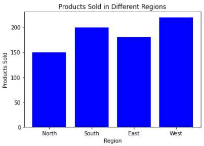
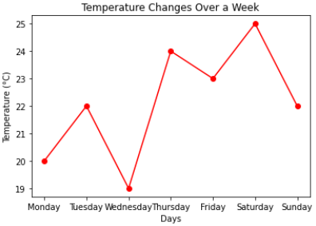
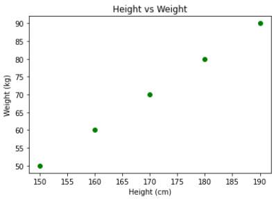

# Visualizing Data

## Visualizing Data: Bar Charts, Line Charts, and Scatterplots

### Bar Charts
**Description:** Bar charts represent categorical data with rectangular bars, where the length or height of each bar is proportional to the value it represents. They are used to compare different categories of data.

**Example:**
Suppose we have data on the number of products sold in different regions in a month.

| Region  | Products Sold |
|---------|---------------|
| North   | 150           |
| South   | 200           |
| East    | 180           |
| West    | 220           |

To visualize this data, a bar chart can be created where each bar's height represents the number of products sold in each region.

**Python Code:**
```python
import matplotlib.pyplot as plt

regions = ['North', 'South', 'East', 'West']
products_sold = [150, 200, 180, 220]

plt.bar(regions, products_sold, color='blue')
plt.xlabel('Region')
plt.ylabel('Products Sold')
plt.title('Products Sold in Different Regions')
plt.show()
```




### Line Charts
**Description:** Line charts display data points connected by straight lines. They are used to track changes over short and long periods.

**Example:**
Consider data showing the temperature changes over a week.

| Day       | Temperature (°C) |
|-----------|-------------------|
| Monday    | 20                |
| Tuesday   | 22                |
| Wednesday | 19                |
| Thursday  | 24                |
| Friday    | 23                |
| Saturday  | 25                |
| Sunday    | 22                |

A line chart can illustrate how the temperature changes throughout the week.

**Python Code:**
```python
import matplotlib.pyplot as plt

days = ['Monday', 'Tuesday', 'Wednesday', 'Thursday', 'Friday', 'Saturday', 'Sunday']
temperature = [20, 22, 19, 24, 23, 25, 22]

plt.plot(days, temperature, marker='o', color='red')
plt.xlabel('Days')
plt.ylabel('Temperature (°C)')
plt.title('Temperature Changes Over a Week')
plt.show()
```



### Scatterplots
**Description:** Scatterplots show the relationship between two variables using dots. Each dot represents an observation in the dataset.

**Example:**
Suppose we have data on the height and weight of individuals.

| Height (cm) | Weight (kg) |
|-------------|-------------|
| 150         | 50          |
| 160         | 60          |
| 170         | 70          |
| 180         | 80          |
| 190         | 90          |

A scatterplot can be used to visualize the correlation between height and weight.

**Python Code:**
```python
import matplotlib.pyplot as plt

height = [150, 160, 170, 180, 190]
weight = [50, 60, 70, 80, 90]

plt.scatter(height, weight, color='green')
plt.xlabel('Height (cm)')
plt.ylabel('Weight (kg)')
plt.title('Height vs Weight')
plt.show()
```



<details>

<summary>Other Types of Charts</summary>

## Other Types of Charts


pie charts
```python
products_sold = [150, 200, 180, 220]
regions = ['North', 'South', 'East', 'West']
plt.pie(products_sold, labels=regions, autopct='%1.1f%%')
```

histograms
```python
temperature = [20, 22, 19, 24, 23, 25, 22]
plt.hist(temperature, bins=5)
```

box plots
```python
temperature = [20, 22, 19, 24, 23, 25, 22]
plt.boxplot(temperature)
```

</details>


# NumPy

**NumPy** is a powerful Python library essential for numerical computing. It provides support for large multi-dimensional arrays and matrices, along with a collection of mathematical functions to operate on these arrays.

## Key Features of NumPy

1. **N-Dimensional Array Object (ndarray)**
   - The core of NumPy is its ndarray, an n-dimensional array of homogeneous data types, which provides fast and efficient operations.

2. **Broadcasting**
   - NumPy's broadcasting allows arithmetic operations on arrays of different shapes, making array operations more intuitive and less verbose.

3. **Vectorization**
   - By eliminating the need for explicit loops, NumPy enables vectorized operations, which are faster and more readable.

4. **Mathematical Functions**
   - NumPy includes a wide array of mathematical functions, from basic operations like addition and multiplication to more complex functions like trigonometric operations and statistical methods.

5. **Linear Algebra**
   - It provides support for linear algebra, random number generation, and Fourier transforms, making it a versatile tool for scientific computing.

6. **Integration with Other Libraries**
   - NumPy serves as the foundation for many other scientific libraries, such as SciPy, pandas, and Matplotlib, enhancing its functionality and usability.

## Installation
You can install NumPy using pip:
```sh
pip install numpy
```

## Basic Examples of Using NumPy

**Creating Arrays**
```python
import numpy as np

# Creating a 1D array
arr1 = np.array([1, 2, 3, 4, 5])
print("1D Array:", arr1)

# Creating a 2D array
arr2 = np.array([[1, 2, 3], [4, 5, 6]])
print("2D Array:\n", arr2)
```
> **Output:**  
> 1D Array: [1 2 3 4 5]  
> 2D Array: [[1 2 3]  
>  [4 5 6]]

**Array Operations**
```python
# Element-wise addition
arr1 = np.array([1, 2, 3])
arr2 = np.array([4, 5, 6])
result = arr1 + arr2
print("Addition:", result)

# Scalar multiplication
result = arr1 * 3
print("Scalar Multiplication:", result)
```
> **Output:**  
> Addition: [5 7 9]  
> Scalar Multiplication: [3 6 9]  

**Mathematical Functions**
```python
# Trigonometric functions
arr = np.array([0, np.pi / 2, np.pi])
result = np.sin(arr)
print("Sine:", result)

# Statistical functions
arr = np.array([1, 2, 3, 4, 5])
mean = np.mean(arr)
std_dev = np.std(arr)
print("Mean:", mean)
print("Standard Deviation:", std_dev)
```
> **Output:**  
> Mean: 3.0  
> Standard Deviation: 1.41421356  

**Linear Algebra**
```python
# Matrix multiplication
arr1 = np.array([[1, 2], [3, 4]])
arr2 = np.array([[5, 6], [7, 8]])
result = np.dot(arr1, arr2)
print("Matrix Multiplication:\n", result)

# Determinant
det = np.linalg.det(arr1)
print("Determinant:", det)
```
> **Output:**    
> Matrix Multiplication: [[19 22]  
>  [43 50]]   
>  Determinant: -2   

**Random Number Generation**
```python
# Generating random numbers
rand_arr = np.random.rand(3, 3)
print("Random Array:\n", rand_arr)

# Random integers
rand_ints = np.random.randint(1, 10, size=(3, 3))
print("Random Integers:\n", rand_ints)
```
> **Output:**  
> Random Array: [[0.69646919 0.28613933 0.22685145]   
>  [0.55131477 0.71946897 0.42310646]  
>  [0.9807642  0.68482974 0.4809319 ]]  
>  
>  Random Integers: [[6 5 4]  
>  [1 5 8]  
>  [1 7 8]]  


**Indexing and Slicing**
```python
arr = np.array([1, 2, 3, 4, 5])

# Slicing
print("Sliced Array:", arr[1:4])

# Advanced indexing
arr2 = np.array([[1, 2, 3], [4, 5, 6], [7, 8, 9]])
print("Element at (1,2):", arr2[1, 2])
```
> **Output:**  
> Sliced Array: [2 3 4]  
> Element at (1,2): 6  

### Use Cases of NumPy

1. **Data Analysis**: NumPy's array operations are useful for data preprocessing and transformation.
2. **Machine Learning**: Libraries like TensorFlow and PyTorch use NumPy arrays for handling data.
3. **Scientific Computing**: NumPy's support for complex mathematical operations makes it indispensable for researchers and scientists.
4. **Image Processing**: Images can be represented as NumPy arrays for processing and manipulation.


# Dimensionality Reduction

## What is Dimentionality?

**Dimensionality** refers to the number of features or variables in a dataset. High-dimensional data has many features, which can lead to challenges in analysis and interpretation. The more features in a dataset, the more complex the analysis will be. Hence, we need to reduce the dimensionality of the data to make it easier to analyze and interpret. 

## The curse of dimensionality

- Handling the high-dimensional data is very difficult in practice, commonly known as the curse of dimensionality. 
- If the dimensionality of the input dataset increases, any machine learning algorithm and model becomes more complex.
- As the number of features increases, the number of samples also gets increased proportionally, and the chance of overfitting also increases.
- If the machine learning model is trained on high-dimensional data, it becomes overfitted and results in poor performance.
- Hence, it is often required to reduce the number of features, which can be done with dimensionality reduction.

## Approaches to Dimensionality Reduction

Dimension reduction techniques like feature selection and feature extraction are crucial in data preprocessing to reduce the complexity of datasets while retaining relevant information. Here’s an overview of both approaches:


### Feature Selection

Feature selection involves choosing a subset of the most relevant features from the original dataset. This process helps in improving model accuracy, reducing training time, and avoiding overfitting. There are three main methods for feature selection:

1. **Filter method**: 
    In this method, the dataset is filtered, and a subset that contains only the relevant features is taken. Some common techniques of filters method are:

    - Correlation
    - Chi-Square test
    - ANOVA
    - Information gain, etc.

2. **Wrapper method**:
    The wrapper method has the same goal as the filter method, but it takes a machine learning model for its evaluation. In this method, some features are fed to the ML model, and evaluate the performance. The performance decides whether to add those features or remove to increase the accuracy of the model. This method is more accurate than the filtering method but complex to work. Some common techniques of wrapper methods are:

    - Forward Selection
    - Backward Selection
    - Bi-directional Elimination

3. **Embedded method**:
    Embedded methods check the different training iterations of the machine learning model and evaluate the importance of each feature. Some common techniques of Embedded methods are:

    - LASSO
    - Elastic Net
    - Ridge Regression, etc.

### Feature Extraction

Feature extraction involves transforming the original features into a lower-dimensional space. This process is useful when the original features are highly correlated or when the dataset has a large number of features. Some common techniques for feature extraction are:

- Principal Component Analysis
- Linear Discriminant Analysis
- Kernel PCA
- Quadratic Discriminant Analysis, etc.

<details>
<summary> Common Techniques of Dimensionality Reduction </summary>  

a. Principal Component Analysis (PCA)  
b. Backward Elimination  
c. Forward Selection  
d. Score Comparison  
e. Missing Value Ratio  
f. Low Variance Filter  
g. High Correlation Filter  
h. Random Forest  
i. Factor Analysis  
j. Auto-Encoder  

</details>


# NLTK

NLTK (Natural Language Toolkit) is a powerful tool for natural language processing written in Python, designed to help computers understand and interpret human language as it is spoken. It serves as an aid in enabling computers to comprehend and manipulate textual data efficiently.

### Key Features of NLTK:

1. **Installation**:
   - NLTK can be installed on Windows using the command `pip3 install nltk`. Once installed, additional datasets (corpora) need to be downloaded for full functionality.

2. **Tokenization**:
   - Tokenization is the process of breaking down a text into individual words. NLTK provides various tokenization methods, such as word tokenization and sentence tokenization.
   - **Example**: Using `word_tokenize` from `nltk.tokenize`, sentences can be broken into individual words:
     ```python
     from nltk.tokenize import word_tokenize
     word_tokenize('Tutorialspoint.com provides high quality technical tutorials for free.')
     ```
     Output: `['Tutorialspoint.com', 'provides', 'high', 'quality', 'technical', 'tutorials', 'for', 'free', '.']`

3. **Stemming**:
   - Stemming is the process of reducing inflected or derived words to their root form. Performing this process will help in reducing the number of words in a sentence or reducing the vocabulary.
   - **Example**: NLTK includes the `PorterStemmer` class for implementing the Porter Stemming algorithm:
     ```python
     from nltk.stem import PorterStemmer
     word_stemmer = PorterStemmer()
     word_stemmer.stem('writing')
     ```
     Output: `'write'`

4. **Part-of-Speech (POS) Tagging**:  
   - Parts-of-speech tagging is the process of assigning a part-of-speech (POS) tag to each word in a sentence. Thsi method is useful in determining the grammatical structure of a sentence.
   - **Example**: NLTK can automatically tag words in sentences:
     ```python
     import nltk
     from nltk import pos_tag, word_tokenize
     nltk.download('averaged_perceptron_tagger')
     pos_tag(word_tokenize('NLTK is a powerful tool for natural language processing.'))
     ```
     Output: `[('NLTK', 'NNP'), ('is', 'VBZ'), ('a', 'DT'), ('powerful', 'JJ'), ('tool', 'NN'), ('for', 'IN'), ('natural', 'JJ'), ('language', 'NN'), ('processing', 'NN'), ('.', '.')]`
